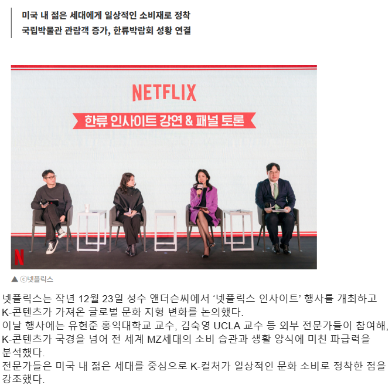
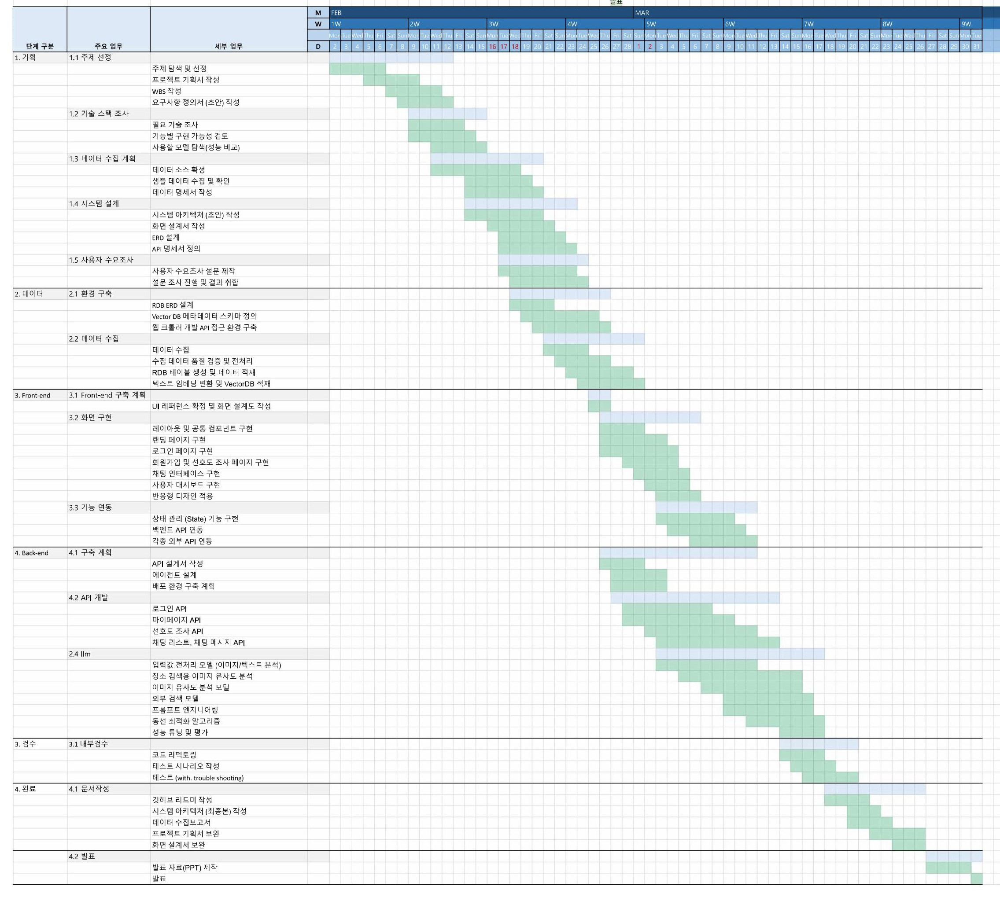
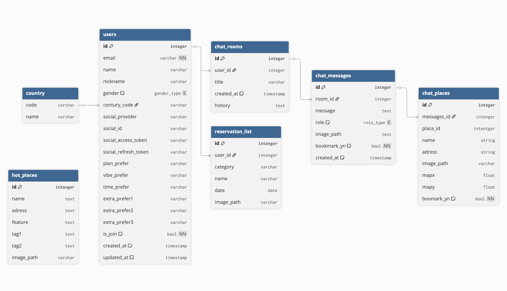
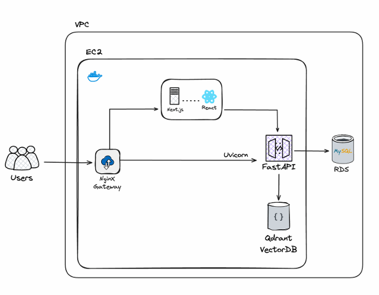

# SKN21-FINAL-2Team
# ✈️ Triver (트리버)

### LLM 기반 초개인화 K-Culture 여행 에이전트  
> 당신이 원하는 한국 여행의 모든 것
---
## 📑 목차

1. [팀 소개](#Team-TRIVERS)  
2. [프로젝트 개요](#프로젝트-개요)  
3. [프로젝트 배경](#프로젝트-배경)  
4. [프로젝트 목표](#프로젝트-목표)  
5. [주요 기능](#주요-기능)  
6. [기술 스택](#기술-스택)  
7. [프로젝트 구조](#프로젝트-구조)    
8. [WBS](#WBS)
9. [수집 데이터 및 활용목적](#수집-데이터-및-활용목적)
10. [ERD](#ERD)
11. [시스템 아키텍쳐](#시스템-아키텍쳐)
12. [성과 및 검증](#성과-및-검증)
13. [트러블슈팅](#트러블슈팅)
14. [향후계획](#향후계획)
---

## 👥 Team TRIVERS

| 이름 | 역할 |
|:---|:---|
| 전우영 | Service Planner |
| 김가람 | Multimodal AI Engineer |
| 박민정 | Frontend Developer |
| 손현우 | UI/UX Designer |
| 장이선 | Data Engineer |

---

## 📌 프로젝트 개요

**Triver**는 단순 정보 나열형 여행 플랫폼을 넘어,  
사용자의 취향과 대화 맥락을 이해하여 **실행 가능한 여행 일정**을 설계하는  
LLM 기반 대화형 여행 추천 서비스입니다.

📅 **프로젝트 기간**  
2026.02.02. ~ 2026.03.31.

---

## 🧭 프로젝트 배경

### 1. k-컬쳐에 대한 관심도와 한국 관광에 대한 관심 증가

<br>
<sup>*출처: [뉴데일리경제 기사]*</sup>

<br>
<sup>*출처: [한국관광데이터랩]*</sup>

K-컬쳐 인기와 함께 방한 관광객은 증가하고 있는 추세.


### 2. 기존 시장 구조의 한계


1. **정보의 파편화** : 외국인이 방한관광을 위해 필요로 하는 앱이 최소 네개 이상. 한번에 정보를 알아볼 수 있는 서비스의 부재.

2. **국내 앱의 로컬 특화** : 방한 외국인이 느끼는 국내앱의 가장 큰 단점은 *다국어 미지원*.
로컬 앱의 특성상 국내 앱만으로는 해외의 관광객들의 만족스러운 검색이 어려움.

3. **트렌드 정보 수집 한계** : 짧은 기간동안 열렸다 닫히는 팝업스토어, 소상공인이 운영하는 개인 가게 등은 SNS를 통해 오픈일정 등을 공개하고 있음. 소셜 미디어를 통해 실시간으로 바뀌는 정보를 해외 방문객이 개별로 일일이 검색해 얻기 어려움.


---

## 🎯 프로젝트 목표

AI를 활용하여 사용자의 취향, 감성, 맥락을 분석하고, 이를 바탕으로 한 여행 장소 추천부터 일정 관리까지 원스톱 서비스를 제공하는 초개인화 K - Culture 여행 에이전트 개발.

---

## 🚀 주요 기능

### 1️⃣ 파편화된 여정의 통합
- RAG 기반, 한국관광공사 등에서 가져온 검증된 정보 추천
- API 연동을 통한 상품 검색과 예약 가능
- 대화형 커머스 환경 제공

### 2️⃣ 여행 계획 피로도 감소
- 사전 설문을 통한 사용자 취향 분석.
- 사용자의 명시적인 요청 뿐 아니라, 추상적인 기분, 과거의 취향과 실시간 상황 분석을 통한 사용자 맞춤 여행 장소, 여행 계획 추천.

### 3️⃣ 동선 최적화 엔진 구축
- VRP 기반 최적 경로 계산
- 이동 수단, 예상 소요 시간 포함
- 식사 및 휴식 시간까지 고려한 정교한 타임라인 생성

### 4️⃣ 멀티모달 & 다국어 지원
- 이미지 기반 검색 지원으로 구체적인 장소를 알지 못 해도 비슷한 장소 검색 가능.
- 다국어 지원을 통한 외국인 관광객 특화 접근성 확보

---

## 🛠 기술 스택

### 💻 Frontend
| Category | Tech |
|----------|------|
| Framework |   |
| Language |  |
| Styling |   |

### ⚙ Backend
| Category | Tech |
|----------|------|
| Framework |   |
| Language |  |
| Database |   |
| AI / LLM |      |

### 🚀 Infrastructure
| Category | Tech |
|----------|------|
| Web Server |  |
| Container |   |

---

## 🗂 프로젝트 구조

```text
SKN21-FINAL-2Team/
├── backend/                  # FastAPI 기반 백엔드 애플리케이션
│   ├── app/                  # 비즈니스 로직, API 라우터, DB 모델
│   ├── data/                 # 데이터 수집 및 전처리
│   ├── tests/                # 백엔드 테스트 코드
│   └── uploads/              # 사용자 업로드 파일 저장소
├── frontend/                 # Next.js 기반 프론트엔드
│   ├── public/               # 정적 에셋
│   ├── src/                  # 리액트 컴포넌트 및 로직
│   └── tests/                # 프론트엔드 테스트 코드
├── nginx/                    # 웹 서버 및 리버스 프록시 설정
├── docker-compose-local.yml  # 로컬 실행 설정
└── README.md
```
---

## 📊 WBS



---
## 📋 수집 데이터 및 활용목적

| 데이터 | 출처 | 활용 목적 |
|:---|:---|:---|
| Tour API | 한국관광공사 | 관광지/문화재/랜드 마크 등의 자주 변하지 않는 관광정보 수집 |
| 트렌드 정보 | Poply 등 웹사이트 | 팝업스토어 등 실시간으로 자주 변하는 트렌디한 정보 수집 |
| 

### 데이터 파이프라인


---
## ERD



---

## 🏗 시스템 아키텍쳐



---

## 🎯 성과 및 검증

| 지표 | 목표 | 달성률 |
|:---|:---|:---|
|  |  |  |
|  |  |  |

---

## 🛠 트러블슈팅

| 문제 | 해결 과정 | 해결 결과 |
|:---|:---|:---|
|  |  |  |
|  |  |  |

---

## 🚀 향후계획

| 기능 | 계획 | 예상 효과 |
|:---|:---|:---|
|  |  |  |
|  |  |  |