# SKN21-FINAL-2Team

# ✈️ Triver (트리버)

### LLM 기반 초개인화 K-Culture 여행 에이전트  
> 당신이 원하는 한국 여행의 모든 것<br>
> 🔗 **배포 공식 사이트:** [triver-s.com](https://triver-s.com/)

---
## 📑 목차

1. [팀 소개](#team-trivers)  
2. [프로젝트 개요](#프로젝트-개요)  
3. [프로젝트 배경](#프로젝트-배경)  
4. [프로젝트 목표](#프로젝트-목표)  
5. [상품추천 타게팅 및 주요 기능](#상품추천-타게팅-및-주요-기능)  
6. [기술 스택](#기술-스택)  
7. [프로젝트 구조](#프로젝트-구조)    
8. [WBS (일정 요약)](#wbs-일정-요약)
9. [데이터 아키텍처](#데이터-아키텍처)
10. [시스템 아키텍쳐](#시스템-아키텍쳐)
11. [핵심 기술 (LLM 에이전트)](#핵심-기술-llm-에이전트)
12. [성과 및 차별점](#성과-및-차별점)
13. [사이트맵 및 화면구성](#사이트맵-및-화면구성)
14. [문제 해결](#문제-해결)
15. [향후계획](#향후계획)
16. [회고](#회고)
---

## 👥 Team TRIVERS

<div align="center">

| | | | |
|:---:|:---:|:---:|:---:|
| 👑 전우영 | 김가람 | 박민정 | 손현우 |
| **PM & Backend Developer** | **Multimodal AI Engineer** | **Frontend Developer & data** | **UI/UX Designer & docs** |
| [](https://github.com/wooaeng) | [](https://github.com/gr-kim-94) | [](https://github.com/silentkit12) | [](https://github.com/kevinhwsohn-afk) |

</div>

---

## 📌 프로젝트 개요

**Triver**는 단순 정보 나열형 여행 플랫폼을 넘어,  
사용자의 취향과 대화 맥락을 이해하여 **실행 가능한 여행 일정**을 설계하는  
LLM 기반 대화형 여행 추천 서비스입니다.

📅 **프로젝트 기간**  
2026.02.02. ~ 2026.03.31.

---

## 🧭 프로젝트 배경

### 1. k-컬쳐에 대한 관심도와 한국 관광에 대한 관심 증가
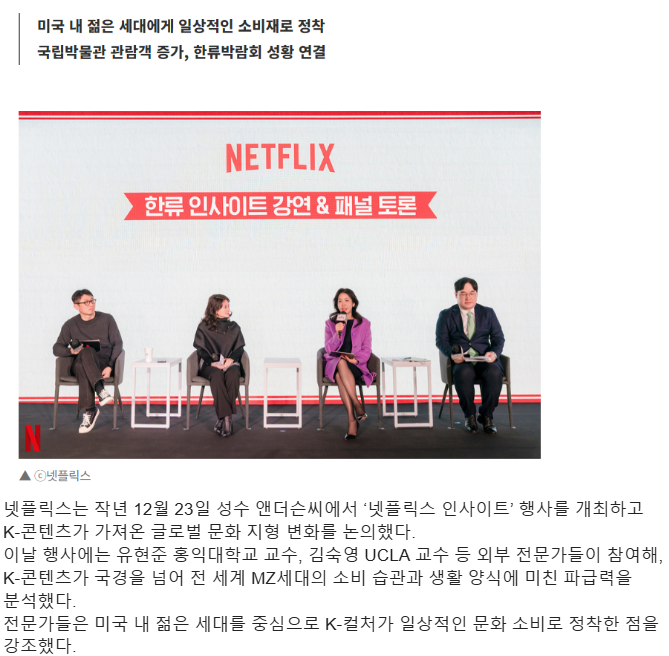
<br>
<sup>*출처: [뉴데일리경제 기사]*</sup>

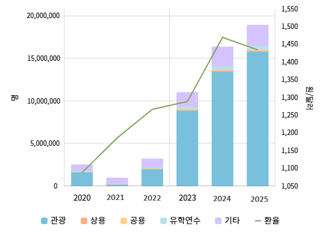
<br>
<sup>*출처: [한국관광데이터랩]*</sup>

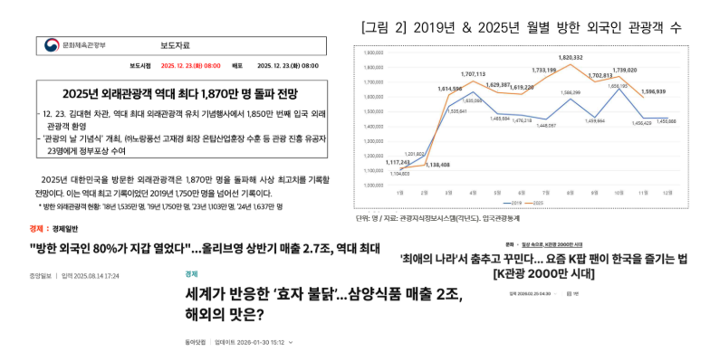

> K-컬쳐 인기와 함께 방한 관광객은 증가하고 있는 추세.


### 2. 기존 시장 구조의 한계


1. **정보의 파편화** : 외국인이 방한관광을 위해 필요로 하는 앱이 최소 네개 이상. 한번에 정보를 알아볼 수 있는 서비스의 부재.

2. **국내 앱의 로컬 특화** : 방한 외국인이 느끼는 국내앱의 가장 큰 단점은 *다국어 미지원*.
로컬 앱의 특성상 국내 앱만으로는 해외의 관광객들의 만족스러운 검색이 어려움.

3. **트렌드 정보 수집 한계** : 짧은 기간동안 열렸다 닫히는 팝업스토어, 소상공인이 운영하는 개인 가게 등은 SNS를 통해 오픈일정 등을 공개하고 있음. 소셜 미디어를 통해 실시간으로 바뀌는 정보를 해외 방문객이 개별로 일일이 검색해 얻기 어려움.


---

## 🎯 프로젝트 목표

AI를 활용하여 사용자의 취향, 감성, 맥락을 분석하고, 이를 바탕으로 한 여행 장소 추천부터 일정 관리까지 원스톱 서비스를 제공하는 초개인화 K - Culture 여행 에이전트 개발.

### 1️⃣ 파편화된 여정의 통합
- RAG 기반, 한국관광공사 등에서 가져온 검증된 정보 추천
- API 연동을 통한 상품 검색과 예약 가능
- 대화형 커머스 환경 제공

### 2️⃣ 여행 계획 피로도 감소
- 사전 설문을 통한 사용자 취향 분석.
- 사용자의 명시적인 요청 뿐 아니라, 추상적인 기분, 과거의 취향과 실시간 상황 분석을 통한 사용자 맞춤 여행 장소, 여행 계획 추천.

### 3️⃣ 동선 최적화 엔진 구축
- VRP 기반 최적 경로 계산
- 이동 수단, 예상 소요 시간 포함
- 식사 및 휴식 시간까지 고려한 정교한 타임라인 생성

### 4️⃣ 멀티모달 & 다국어 지원
- 이미지 기반 검색 지원으로 구체적인 장소를 알지 못 해도 비슷한 장소 검색 가능.
- 다국어 지원을 통한 외국인 관광객 특화 접근성 확보

---

## 🚀 상품추천 타게팅 및 주요 기능

### 타겟 사용자 & 사용 시나리오
- **내국인:** "이번 주말 혼자 서울에서 감성 카페 투어 하고 싶어"
- **외국인:** "I'm visiting Seoul next week with my family, recommend kid-friendly spots"
- **이미지 기반:** 인스타에서 본 사진과 비슷한 장소 찾기

### 주요 기능 맵
| 기능                  | 설명                               |
| :-------------------- | :--------------------------------- |
| 대화형 여행 플래닝    | 멀티턴 대화로 일정 자동 생성       |
| 장소 추천 (RAG)       | 하이브리드 검색으로 맞춤 장소 추천 |
| 이미지 유사 장소 검색 | CLIP 기반 사진 → 유사 장소 매칭    |
| 트렌드 통합           | 팝업스토어, 축제 등 실시간 반영    |
| 날씨 연동             | 날씨 기반 실내/실외 추천 전환      |
| 다국어 지원           | 4개 언어 네이티브 응답             |
| 일일 추천             | 사용자별 매일 새로운 추천 생성     |
| 북마크 & 다이어리     | 장소 저장 + 여행 기록              |

### 사용자 흐름 (User Flow)

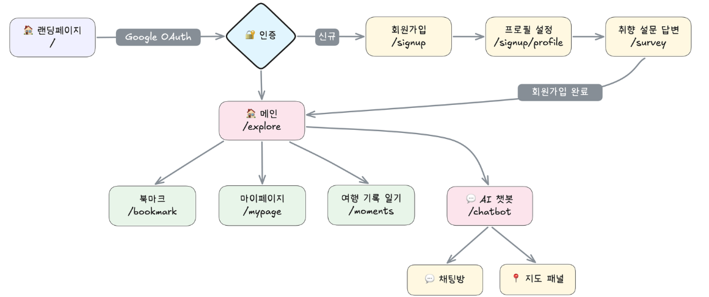
---
## 🛠 기술 스택

### 💻 Frontend
| Category  | Tech                                                                                                                                                                                                       |
| --------- | ---------------------------------------------------------------------------------------------------------------------------------------------------------------------------------------------------------- |
| Language  |                                                                                             |
| Framework |   |
| Styling   |                                                                                         |

### ⚙ Backend
| Category        | Tech                                                                                                                                                                                                         |
| --------------- | ------------------------------------------------------------------------------------------------------------------------------------------------------------------------------------------------------------ |
| Language        |                                                                                                           |
| Framework       |                                                                                                        |
| Database        |                                       |
| ORM / Migration |                                                                                                                                     |
| Infrastructure  |   |

### 🧠 LLM
| Category  | Tech                                                                                                                                                                                                                                                          |
| --------- | ------------------------------------------------------------------------------------------------------------------------------------------------------------------------------------------------------------------------------------------------------------- |
| Framework |                                                                                                     |
| Model     |    |

---

## 🗂 프로젝트 구조

```text
SKN21-FINAL-2Team/
├── backend/                  # FastAPI 기반 백엔드 애플리케이션
│   ├── alembic/              # DB 마이그레이션 관리
│   ├── app/                  # 비즈니스 로직, API 라우터, DB 모델
│   │   ├── api/              # 엔드포인트 라우팅 모듈
│   │   ├── agents/           # LangGraph 기반 LLM 의도 분석 및 검색 에이전트
│   │   ├── core/             # 데이터베이스 연결 및 전역 설정
│   │   └── utils/            # DB(Qdrant/MySQL) 접근 로직 추출 및 공통 모듈 (Refactored)
│   ├── data/                 # 데이터 수집 및 전처리 스크립트
│   ├── evaluation/           # RAG 및 LLM 성능 평가(Ragas) 스크립트
│   └── tests/                # 백엔드 유틸리티 및 모듈 단위 테스트(pytest)
├── docs/                     # 시스템, 아키텍처 및 기획 산출물 문서
├── frontend/                 # Next.js 16 기반 프론트엔드
│   ├── public/               # 이미지, 로고 등 정적 에셋
│   ├── src/
│   │   ├── app/              # Next.js App Router 기반 경로 및 UI 조립
│   │   │   └── api/          # Next.js API Routes (백엔드 프록시 및 스트리밍 처리)
│   │   ├── components/       # 재사용 가능한 UI 컴포넌트 (PlaceCard 모듈 등)
│   │   ├── features/         # 채팅방 등 고유 도메인 로직 컴포넌트
│   │   ├── hooks/            # 상태 및 비동기 데이터를 다루는 Custom Hooks (useAsyncData 유틸)
│   │   ├── services/         # 백엔드 API 통신 규격 관리
│   │   ├── i18n/             # 다국어(i18next) 처리 및 번역 리소스
│   │   ├── lib/              # 공통 유틸리티 함수
│   │   ├── config/           # 전역 설정 및 상수 관리
│   │   └── types/            # 공통 타입 정의
│   └── tests/                # 프론트엔드 컴포넌트 및 Hook 단위 테스트
├── nginx/                    # Nginx 웹 서버 및 리버스 프록시 설정
├── deploy/                   # 운영 환경(EC2 배포) 인프라 구성 스크립트
├── docker-compose-local.yml  # 도커 컨테이너 로컬 통합 실행 환경 
└── README.md                 # 리드미 (현재 문서)
```
---

## 📊 WBS (일정 요약)

8주간의 프로젝트 진행 단계를 아래와 같이 수행했습니다.

|      단계       |  주차   | 주요 업무            | 세부 활동                                                       |
| :-------------: | :-----: | :------------------- | :-------------------------------------------------------------- |
|    **기획**     | 1~2주차 | 산출물 정의 및 설계  | 주제 선정, 요구사항 명세, WBS/메뉴트리 작성, UX/UI 와이어프레임 |
|   **데이터**    | 2~3주차 | 수집 및 전처리       | 한국관광공사 등 외부 API 크롤링, 데이터 정제 로직 스키마 통일   |
|  **AI/모델링**  | 3~4주차 | LangGraph / RAG 구축 | 멀티모달(텍스트+이미지) 하이브리드 Retriever 파이프라인 개발    |
| **서비스 개발** | 5~6주차 | BE / FE 구현         | Next.js 프론트엔드 채팅룸, FastAPI 백엔드 연동, DB 세팅         |
|   **고도화**    |  7주차  | 최적화 및 평가       | RAGAS 성능 지표 검증, 응답 레이턴시 병목 개선, 네이버 지도 연동 |
|    **배포**     |  8주차  | CI/CD 배포 및 마무리 | GitHub Actions 기반 AWS 무중단 배포 적용, 최종 발표 자료 준비   |

<details>
<summary><b>(클릭하여 WBS 이미지 보기)</b></summary>
<br/>

**상세 일정표 (Gantt Chart)**  
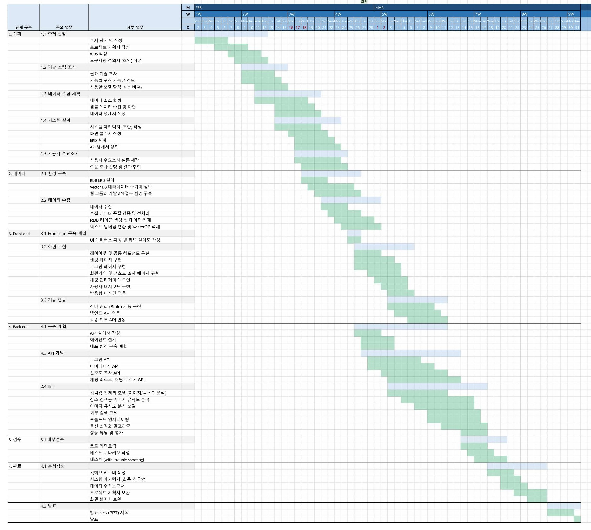

</details>

---
## 📋 데이터 아키텍처

### 1️⃣ 수집 데이터 현황
다양한 외부 출처로부터 신뢰할 수 있는 장소/관광/이미지 데이터를 약 **4,800여 건**을 수집하여 Vector DB에 적재했습니다.

|    카테고리     | 데이터 출처                               | 수집 방식  | 목적                          | 데이터 건수 |
| :-------------: | :---------------------------------------- | :--------: | :---------------------------- | :---------: |
|   **관광지**    | 한국관광공사, Visit Seoul                 |    API     | 메인 관광 스팟 추천           |    1,632    |
|   **음식점**    | 한국관광공사, Visit Seoul                 |    API     | 식사/맛집 장소 추천           |    2,259    |
|    **숙박**     | 한국관광공사, Visit Seoul                 |    API     | 숙박 장소 추천                |     345     |
| **쇼핑 (상설)** | 올리브영, 무신사, 다이소 등 공식 홈페이지 | 웹 크롤링  | K-브랜드 쇼핑 장소 추천       |     82      |
|    **투어**     | Visit Seoul                               | 웹 크롤링  | 투어 패키지 보조 추천         |     386     |
|   **컨텐츠**    | 서울문화포털, Poply                       | 크롤링/API | 공연 및 전시 타임라인 추천    |     250     |
| **팝업스토어**  | Poply 등                                  | 웹 크롤링  | 단기 트렌드(팝업) 장소 추천   |      9      |
|   **이미지**    | 한국관광공사, Poply 등 통합               | 크롤링/API | 멀티모달(사진) 기반 감성 검색 |    4,864(일부 중복값)    |

---

### 2️⃣ 데이터 전처리 및 보강 파이프라인
원시(Raw) 데이터를 고품질 추천 데이터로 만들기 위해 아래의 3단계 가공을 거칩니다.

1. **호출 및 통합:** Python(`requests`, `BeautifulSoup`) 스크래핑 및 OPEN API 호출.
2. **클렌징 및 정규화:** 미사용 필드 제거, 중복 데이터 병합, 스키마 통일 및 텍스트 자연어 전처리.
3. **LLM 지능 보강:** 누락성이 높은 데이터에 대해 `gpt-4o-mini`를 사용하여 장소의 설명, 매력 포인트(태그) 등을 동적 자동 생성.

> 💡 **특화 전략 포인트**
> - **멀티모달 이원화:** 텍스트 의미 검색을 위한 `places` 컬렉션과 이미지 감성 검색을 위한 `photos` 컬렉션을 분리 운용.
> - **핫플레이스 군집화:** 행정구역 상 애매한 '홍대', '샤로수길', '송리단길' 등의 지역을 커스텀 사전으로 묶어 **별도 데이터**로 구축.
> - **동적 데이터 업데이트:** 팝업스토어나 전시/공연 등 만료일이 있는 정보는 **스케줄러**를 통해 새로운 정보 업데이트와 동시에 기간 만료 시 자동 페일오버/삭제 처리.
> - **리서치 기반 임베딩 증강:** 배달의민족, 한국관광공사 통계 기반의 '국적별 외국인 선호 음식/관광지' 데이터를 텍스트 임베딩 컨텍스트에 추가 주입.

---

### 3️⃣ RAG / DB 엔진 스키마 요약
복잡성을 줄이고 속도를 높이기 위해 도메인 특화 데이터베이스 모델링을 적용했습니다.

- **RDBMS (MySQL) |** 사용자 정보(`Users`), 채팅 세션 맥락(`ChatRooms`, `ChatMessages`), 북마크(`ChatPlaces`), 부가 기능(`Reservations`, `DiaryEntries`)
- **Vector DB (Qdrant) |** 고차원 벡터 임베딩 저장 공간 (`places` 텍스트 벡터, `photos` 이미지 벡터)
- **Checkpointer |** LangGraph의 상태(State) 추적 및 복원을 담당하는 대화 메모리 체인 (MySQL 연동)

**[ERD 구조]**  
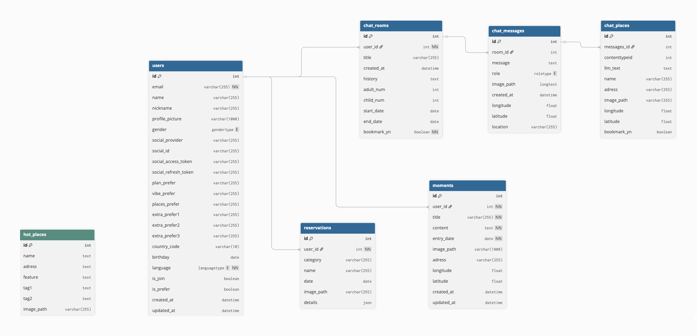

---

## 🏗 시스템 아키텍쳐

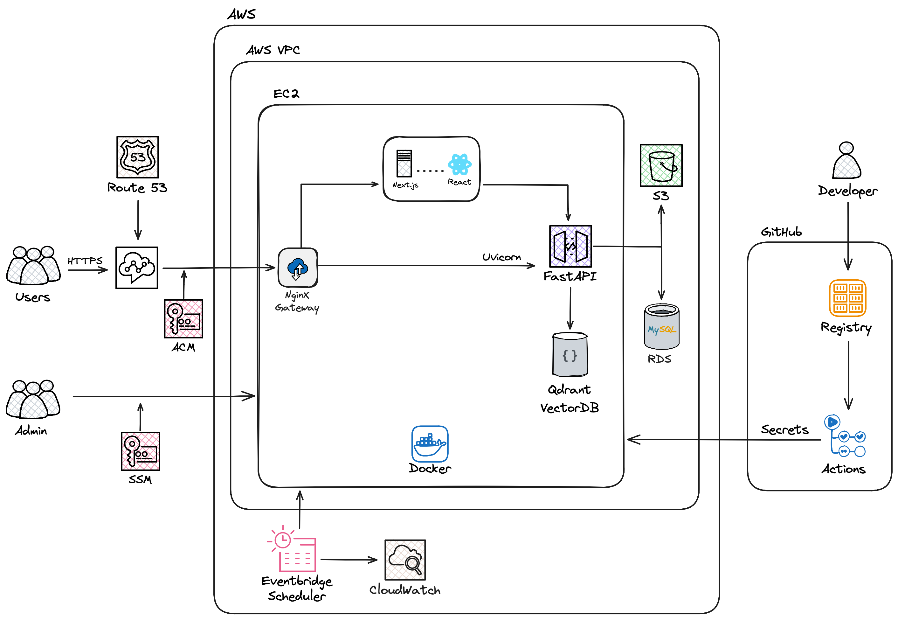

### 🚀 CI/CD 웹 배포 파이프라인
- **GitHub Actions**를 활용하여 `release` 브랜치는 Staging(스테이징)으로, `main` 브랜치는 Prod(운영) 환경으로 자동 배포되도록 구축했습니다.
- 검증 ➡️ 빌드 ➡️ **GHCR(GitHub Container Registry)** 푸시 ➡️ AWS EC2 원격 접속 후 최신 이미지 Pull 및 컨테이너 무중단 재시작(`/api/healthz` 헬스 체크)의 일련 과정을 빈틈없이 자동화했습니다.

---

## 🤖 핵심 기술 (LLM 에이전트)

### 1️⃣ LangGraph 파이프라인

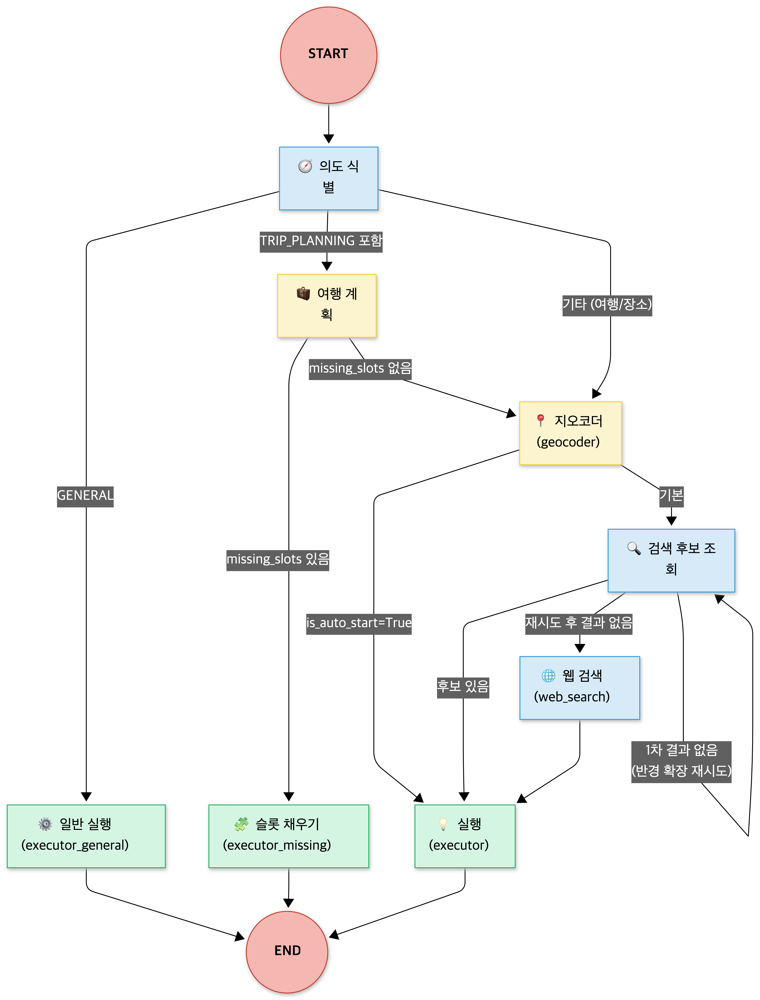

- 단순 Chatbot이 아닌 **상태 기계(State Machine) 기반 에이전트**로, 각 노드가 전문화된 역할을 수행합니다.
- `Intent Node` (의도 분류) → `Planner Node` (검색식/일정 계획) → `Geocoder Node` (좌표 변환) → `Retriever Node` (검색) → `Web Search Node` (웹 검색 Fallback) → `Executor Node` (최종 요약 응답 / 누락 처리 / 일반 응답)의 흐름으로 라우팅됩니다.

### 2️⃣ 4-Layer 하이브리드 멀티채널 검색 (Retriever)
단순한 텍스트 검색을 넘어, 정확도와 사용자 요구 충족을 위해 **4단계(Layer)로 구성된 정교한 리트리버 파이프라인**을 설계했습니다.

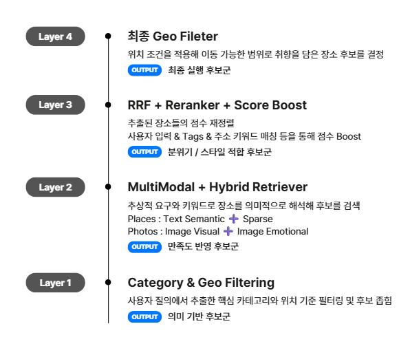


### 3️⃣ 초개인화 메커니즘
- 사용자의 가입 설문(여행 스타일,  분위기, 선호 테마) 정보와 대화 이력을 LLM이 기억 및 요약합니다.
- 이를 바탕으로 접속시에 HOME 페이지에서 **개인 맞춤 추천 카드**를 생성하고, 챗봇과의 대화시 현장의 실시간 날씨 정보(API 연동)에 따라 추천 장소에 반영합니다.

---

## 🏆 성과 및 차별점

### 기존 서비스 대비 차별점
| 비교 항목   | 기존 여행 서비스                      | Triver                                                       |
| ----------- | ------------------------------------- | ------------------------------------------------------------ |
| 추천 방식   | 키워드 검색, 리뷰 평점순              | LLM 대화형 + RAG 기반 하이브리드 검색                        |
| 개인화      | 사이트 내 단순 클릭 기록 기반         | 가입 설문 + 대화 맥락 + 실시간 날씨 일관 적용                |
| 일정 생성   | 사용자가 장소를 하나씩 스크랩 후 구성 | AI가 동선과 소요시간을 고려하여 자동 타임라인 생성           |
| 이미지 기반 | 미지원                                | CLIP 모델 활용, 사진으로 유사한 느낌의 장소를 직접 매칭      |
| 트렌드 반영 | 정적 데이터 (주기적 수동 업데이트)    | 팝업/축제 실시간 자동 크롤링 및 만료 데이터 클렌징 처리      |
| 언어 지원   | 브라우저 확장 번역 수준               | 프롬프트 레벨에서의 4개 국어(한/영/일/중) 네이티브 응답 생성 |

### 주요 기술적 성과
- LangGraph를 활용한 8개 노드 기반의 유연한 LLM 에이전트 파이프라인 구축.
- 멀티모달(텍스트+이미지) 하이브리드 검색 파이프라인 설계.
- 스케줄러를 통한 자동 데이터 수집/검증 및 SSE(Server-Sent Events) 스트리밍 기술로 끊김 없는 실시간 대화 경험 구현.
- **체계적인 성능 평가 체계 도입:** 기존 Ragas 프레임워크와 자체 구축한 'LLM 판관(Judge)' 평가 모델을 결합하여, 3차례에 걸쳐 검색 및 생성 지표를 꼼꼼하게 측정하고 개선했습니다.
- **비즈니스 로직 모듈화 및 TDD 기반 리팩토링:** 백엔드의 DB/VectorDB(Qdrant) 접근 코드를 `utils`로 분리하고 프론트엔드의 상태 관리를 `hooks`로 모듈화하였으며, 독립된 단위 테스트(`tests/`) 코드를 작성하여 프로덕션 레벨의 유지보수성을 극대화했습니다.

### 📊 RAG & 리트리버 성능 검증 (LLM-as-a-Judge 도입)
서비스 특성상 정해진 단답형 정답이 없고 에이전트의 대화 자유도가 높은 점을 고려하여, 전통적인 RAGAS 생성 평가 와 함께 **의미적 맥락을 판단하는 'LLM 기반 판관(Judge)' 평가 모델**을 자체 도입했습니다. 총 3차례의 테스트 및 고도화 사이클을 거쳐 검색 및 생성 품질을 최적화했습니다.

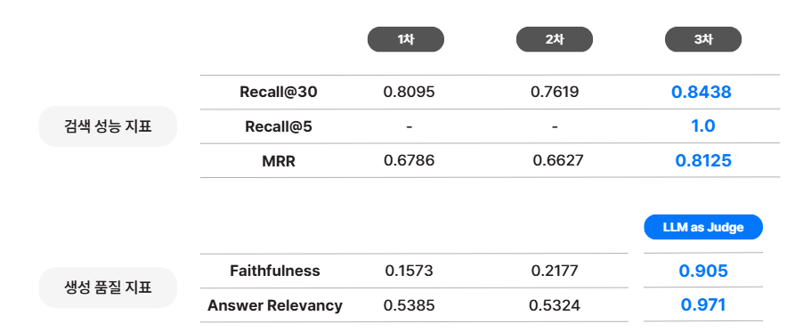

**[차수별 검색 성능 개선 과정]**
- **1차 ➡️ 2차:** Visit Seoul, 한국관광공사 등 대규모 데이터셋이 Vector DB에 대거 추가되면서, 검색 대상 풀(Pool)이 커지고 노이즈(Noise) 데이터가 섞여 일시적으로 지표가 하락했습니다.
- **3차 최종 튜닝 (DB 검색 고도화):** 강력한 **위치(Geo) 필터**를 엄밀히 적용하고, Payload의 `tags` 값을 활용하는 **Sparse 검색 결합(템플릿 고도화)**을 도입하여 노이즈를 성공적으로 제어했습니다.

**[최종 평가 지표 도출]**
- **검색 성능 (Retrieval):** Vector DB의 Payload가 단순 문장이 아닌 Key-Value 구조인 점을 감안해, 단어 매칭 위주의 Precision 측정 대신 순위 위주의 평가를 진행했습니다. 그 결과 최종 **Recall `0.84`**, **MRR `0.81`**의 안정적이고 뛰어난 검색 정확도를 달성했습니다.
- **생성 성능 (Generation):** LLM 판관 심사 결과, 최종 3차 평가에서 **`0.9`점 대**의 우수한 점수를 기록했으며, 정서적이고 감성적인 뉘앙스를 요구하는 응답 기준에서도 결함이 없음을 검증 완료했습니다.

---

## 🖥 사이트맵 및 화면구성

> [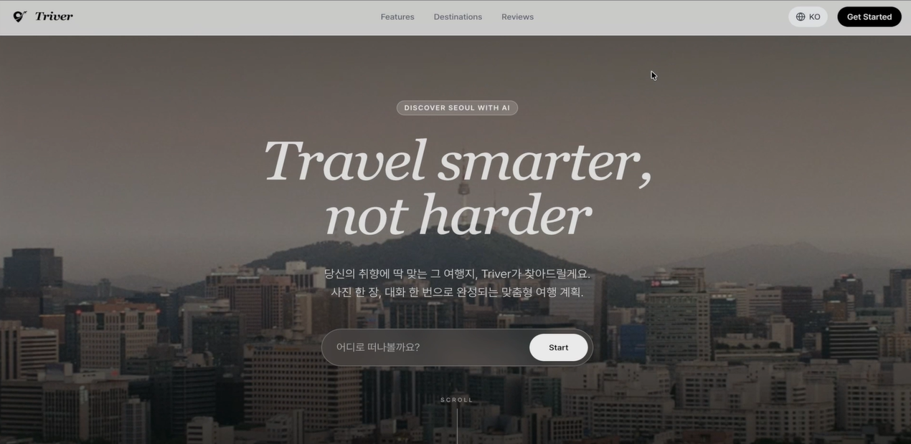](https://drive.google.com/file/d/1AfZIyjO6Gq0JI4cBpHtARvPeiubsMH3u/view?usp=sharing)
<br>
<sup>*이미지를 클릭해서 시연영상 보러가기*</sup>

- **랜딩 & 회원가입**: 서비스 소개 레이아웃, Google OAuth 로그인 접속, 회원가입시 3단계 취향 설문(스타일, 분위기, 테마) 화면
- **채팅룸 (핵심)**: 대화형 LLM 채팅 인터페이스 구현, 이미지 업로드 기반 추천, STT 인식 기능, 완성된 일정 마크다운/타임라인 제공, 지도 연동
- **Home**: 실시간 트렌드(팝업스토어/공연 전시), 카테고리별 장소 추천 섹션, 사용자 맞춤 일일 추천 카드 화면
- **Moments** : 여행 기록을 남길 수 있는 다이어리 UI
- **Bookmark** : 채팅룸에서 저장한 북마크 대화 이력, 북마크 된 장소 이력 확인 및 관리, 북마크 내역 선택으로 채팅 시작
- **마이페이지**: 개인정보 관리, 여행 취향 변경, 한/중/영/일 다국어 전환, 여행지 테마 추천, 예약 정보 등록 및 관리

---

## 🛠 문제 해결

|문제                                                                                                                  | 해결 과정                                                                                                                                                                                                                                                                                                                                                                                                                                                                                                                                                                        | 해결 결과                                                                                                                                                                                 |
| :--------------------------------------------------------------------------------------------------------------------------------------------------------------------------------------------- | :------------------------------------------------------------------------------------------------------------------------------------------------------------------------------------------------------------------------------------------------------------------------------------------------------------------------------------------------------------------------------------------------------------------------------------------------------------------------------------------------------------------------------------------------------------------------------- | :---------------------------------------------------------------------------------------------------------------------------------------------------------------------------------------- |
| **LLM 에이전트 응답 지연(Latency)**<br>연쇄적인 노드 호출과 무거운 검색 로직으로 인해 사용자가 체감하는 첫 응답 시간(TTFT)과 전체 생성 시간이 길어지는 문제 발생                               | **평균 레이턴시 축소 6대 전략 적용:**<br>1. Reranker 모델 경량화 도입<br>2. Intent 노드의 분석 작업 분리 및 비동기 병렬 처리 적용<br>3. Multi-channel Retriever 병렬 검색 구현<br>4. 불필요한 Candidates 개수 과감히 축소 (20개 → 5개)<br>5. Executor 노드 계획 추천 시 가장 적합한 Top 1개 후보군만 사용하도록 간소화<br>6. 프롬프트 엔지니어링을 통한 불필요 출력 토큰 최적화                                                                                                                                                                                                  | 각 에이전트 노드의 병목 현상이 해소되어 **전체 파이프라인의 평균 레이턴시가 대폭 감소**하였으며, 부드럽고 빠른 실시간 대화 스트리밍 체감 속도 확보                                        |
| **장소 맥락 인식 불가 (키워드 매칭 오류)**<br>'강남에서 갈 수 있는 카페' 요청 시, 실제 강남이 아닌 이름만 똑같은 '홍대에 있는 강남카페'가 검색되는 등 공간적(Spatial) 맥락 인지 실패 문제 발생 | **3단계 공간 지능화(Spatial Intelligence) 로직 도입:**<br>**1. LLM 의도 분석 좌표 추출:** 사용자 발화('삼성역 조용한 카페')에서 지명 의도를 분리해 중심 좌표(위경도)를 선제적으로 도출<br>**2. 로컬 지역 사전(Landmark Dictionary) 구축:** '송리단길', '샤로수길' 등 행정구역에 없는 핫플레이스 고유명사에 위경도와 반경(예: 800m)을 하드 매핑하여 해결<br>**3. 동적 Geocoding 연결 (Naver API):** 사전에 없는 신규 장소('엔코아미술관')가 요청되었을 경우, `Naver Search API`로 실제 지번 주소를 동적 추출 후 `Naver GeoCoder`를 태워 좌표로 번역하는 강력한 Fallback 회로 구축 | 단순 텍스트 표기 매칭으로 일어나는 엉뚱한 오안내(False Positive)가 완벽히 차단됨. 사용자의 요청 위치를 기반으로 한 **정확한 반경 기반(Geo Filtering)** 매칭이 이루어져 추천 신뢰도 극대화 |

---

## 🚀 향후계획

| 기능                  | 계획                                                   | 예상 효과                                                                              |
| :-------------------- | :----------------------------------------------------- | :------------------------------------------------------------------------------------- |
| 추천 지역 확대        | 서울 > 광역시 > 전국                                   | 한국 전역의 관광지를 추천 가능                                                         |
| 지원 언어 확대        | 한국 방문 top 20 개국의 사용 언어 지원                 | 방한 관광객의 편리성 증대                                                              |
| 사용자 만족도 조사    | 사용자 피드백을 통한 DB 추가와 사용자 기반의 정보 축척 | 축척된 자료를 통한 보다 정확한 선호도 기반 추천 가능                                   |
| 실예약 시스템 연동    | 숙박, 레스토랑 등 실제 타 서비스 API 연동              | 단순 추천을 넘어 통합 커머스 플랫폼으로 진화                                           |
| 커뮤니티 및 소셜 기능 | 사용자의 여행 일정/후기 공유 및 평점 시스템 도입       | 유저 리텐션 증가 및 자생적인 핫플레이스 DB 구축                                        |
| 모바일 전용 앱 출시   | React Native 또는 Flutter 기반 네이티브 앱 개발        | 외부 이동이 많은 여행 중(On-site) 접근성 극대화 및 모바일 기기 위치기반(LBS) 연동 강화 |

---

## ✍️ 회고

| 팀원   | 회고 내용 |
| :----- | :-------- |
| 전우영 |           |
| 김가람 | 2개월동안 정말 쉬지 않고 개발한 것 같습니다. 그랬기때문에 많이 배우고 좋은 결과를 얻을 수 있었던거 같네요. AI를 개발하면서 AI 활용하는 방법은 따로 적용하며 다양한 관점에서 AI를 접할 수 있었던 프로젝트였습니다. 제가 부족한 부분도 다시 정리할 수 있었고 시야도 넓힐 수 있었습니다. 지금까지 굳이 도전 하지 않았던 것들도 도전해볼 수 있었던 프로젝트였습니다. 막내이자 PM이었던 우영님 진짜 멋있고 너무 고생 많았고, 멘토님께도 너무 감사드립니다. 조만간 연락드리겠습니다. 못다한 수다 떨어요. |
| 박민정 | 최종프로젝트를 진행하면서, 이전 소규모 프로젝트와는 달리 실제 사용자를 상정하고 사용할 수 있도록 하는 기획에서부터 프로그램을 만들어 서버에 배포하는 것 까지 전체적인 플로우를 경험할 수 있었습니다. 진행 중 크고 작은 버그나 문제 상황들을 마주하며, 팀원들과 함께 머리를 맞대고 의논하면서 AI와 LLM의 활용과 개발자의 다양한 업무들에 대해 익혀갈 수 있는 시간이 되었습니다. 각자의 역할은 나누어져 있었으나, 이슈가 생길 경우 모두 함께 모여서 회의하고, 해결 방법을 논의하면서 자신의 파트가 아닌 부분의 일의 진행 역시 개략적으로 파악하고 이해할 수도 있었습니다. 6개월간의 기간 동안 마지막까지 많은 것을 배워 갑니다. |
| 손현우 | 저는 UI 프런트엔드의 완성도를 높이는 디버깅 작업과 프로젝트의 결과물을 알리는 문서 작성 및 시연 영상 제작을 맡았습니다. 사용자의 눈에 보이는 기능을 완벽하게 시연하기 위해 작은 디테일 하나 놓치지 않는 세심한 관찰력 의 중요성을 체감했습니다. 단순한 기능 구현을 넘어, 전체 프로젝트 기획의 흐름 속에서 저의 역할을 되짚어보며 스스로의 가능성을 발견한 뜻깊은 시간이었습니다. 이번 경험을 통해 배운 세밀한 업무 태도를 앞으로의 작업에도 녹여내고 싶습니다. |
