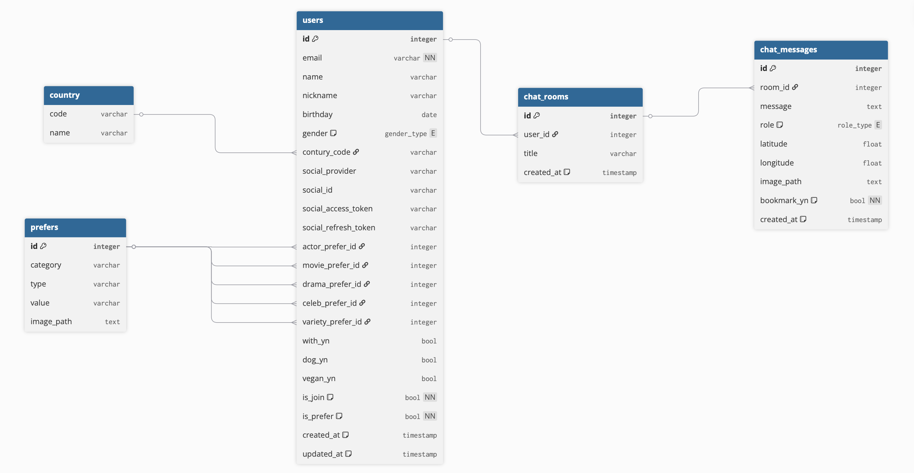

# RDB 설계
## 1. ERD

## 2. 테이블 설계

### 1. `country` (국가 코드)
| 컬럼명 | 데이터 타입 | 제약조건 | 설명                           |
| :----- | :---------- | :------- | :----------------------------- |
| `code` | varchar     | PK       | 국가 코드 (ISO 3166-1 alpha-2) |
| `name` | varchar     |          | 국가명                         |

### 2. `prefers` (취향/선호도 항목)
| 컬럼명       | 데이터 타입 | 제약조건           | 설명                       |
| :----------- | :---------- | :----------------- | :------------------------- |
| `id`         | integer     | PK, Auto Increment | 고유 ID                    |
| `category`   | varchar     |                    | 카테고리 ('style' 등)      |
| `type`       | varchar     |                    | 타입 ('plan', 'member' 등) |
| `value`      | varchar     |                    | 항목 값 (Planning (J) 등)  |
| `image_path` | text        |                    | 이미지 경로                |

### 3. `users` (사용자)
| 컬럼명                 | 데이터 타입 | 제약조건            | 설명                           |
| :--------------------- | :---------- | :------------------ | :----------------------------- |
| `id`                   | integer     | PK, Auto Increment  | 사용자 고유 ID                 |
| `email`                | varchar     | NN, Unique          | 이메일                         |
| `name`                 | varchar     |                     | 이름                           |
| `nickname`             | varchar     |                     | 닉네임                         |
| `birthday`             | date        |                     | 생년월일                       |
| `gender`               | gender_type | Enum                | 성별 (MALE, FEMALE, OTHER)     |
| `country_code`         | varchar     | FK (`country.code`) | 국가 코드                      |
| `social_provider`      | varchar     |                     | 소셜 로그인 제공자 (google 등) |
| `social_id`            | varchar     |                     | 소셜 서비스 ID                 |
| `social_access_token`  | varchar     |                     | 소셜 액세스 토큰               |
| `social_refresh_token` | varchar     |                     | 소셜 리프레시 토큰             |
| `plan_prefer_id`       | integer     | FK (`prefers.id`)   | 여행 계획 선호 ID              |
| `member_prefer_id`     | integer     | FK (`prefers.id`)   | 동행자 선호 ID                 |
| `transport_prefer_id`  | integer     | FK (`prefers.id`)   | 이동수단 선호 ID               |
| `age_prefer_id`        | integer     | FK (`prefers.id`)   | 연령대 선호 ID                 |
| `vibe_prefer_id`       | integer     | FK (`prefers.id`)   | 여행 분위기 선호 ID            |
| `movie_prefer_id`      | integer     | FK (`prefers.id`)   | 영화 선호 ID (New)             |
| `drama_prefer_id`      | integer     | FK (`prefers.id`)   | 드라마 선호 ID (New)           |
| `variety_prefer_id`    | integer     | FK (`prefers.id`)   | 예능 선호 ID (New)             |
| `is_join`              | bool        | NN, Default: False  | 가입 완료 여부                 |
| `is_prefer`            | bool        | NN, Default: False  | 선호도 조사 완료 여부          |
| `created_at`           | timestamp   | Default: Now        | 생성 일시                      |
| `updated_at`           | timestamp   | Default: Now        | 수정 일시                      |

### 4. `chat_rooms` (채팅방)
| 컬럼명       | 데이터 타입 | 제약조건           | 설명           |
| :----------- | :---------- | :----------------- | :------------- |
| `id`         | integer     | PK, Auto Increment | 채팅방 고유 ID |
| `user_id`    | integer     | FK (`users.id`)    | 사용자 ID      |
| `title`      | varchar     |                    | 채팅방 제목    |
| `created_at` | timestamp   | Default: Now       | 생성 일시      |

### 5. `chat_messages` (채팅 메시지)
| 컬럼명        | 데이터 타입 | 제약조건             | 설명                     |
| :------------ | :---------- | :------------------- | :----------------------- |
| `id`          | integer     | PK, Auto Increment   | 메시지 고유 ID           |
| `room_id`     | integer     | FK (`chat_rooms.id`) | 채팅방 ID                |
| `message`     | text        |                      | 메시지 내용              |
| `role`        | role_type   | Enum (human, ai)     | 발신자 역할              |
| `latitude`    | float       |                      | 위도 (위치 기반 질문 시) |
| `longitude`   | float       |                      | 경도 (위치 기반 질문 시) |
| `image_path`  | text        |                      | 이미지 경로              |
| `bookmark_yn` | bool        | NN, Default: False   | 북마크 여부              |
| `created_at`  | timestamp   | Default: Now         | 생성 일시                |

# Vector DB 설계