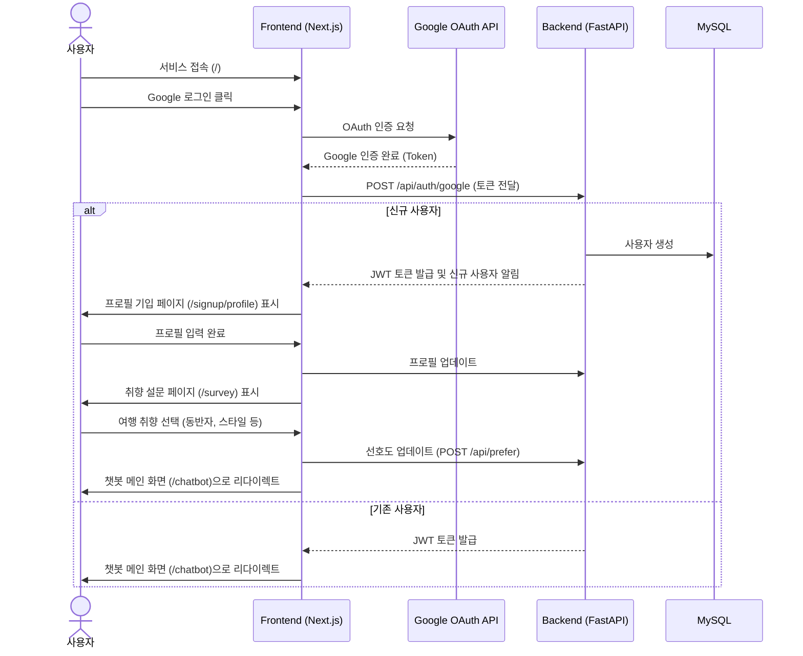
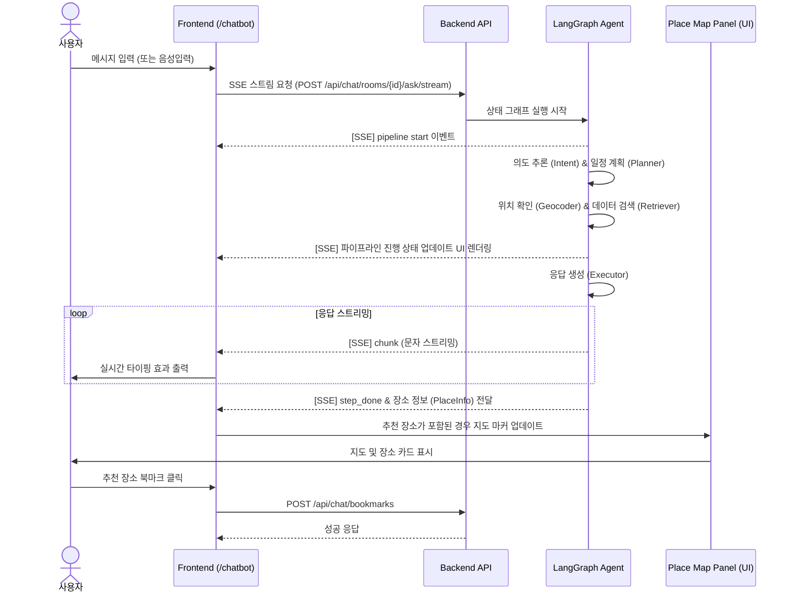
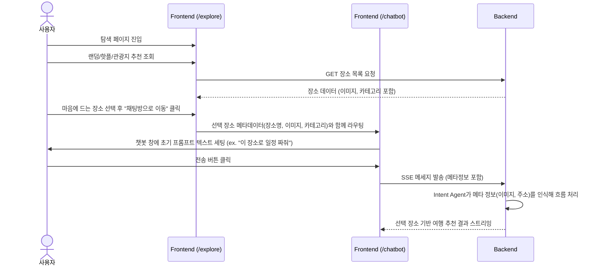
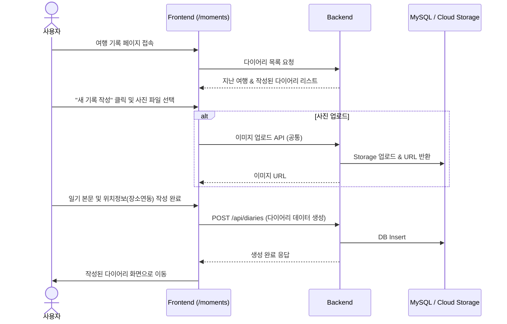

# 사용자 흐름도 (User Flow Diagrams)

> 랜딩 페이지부터 챗봇을 통한 여행 계획, 탐색 및 기록까지의 전체 사용자 여정과 시스템 간의 상호작용을 나타내는 시퀀스 다이어그램입니다.

---

## 1. 인증 및 온보딩 흐름 (Auth & Onboarding Flow)

사용자가 처음 서비스에 접속하여 Google 로그인을 거치고 프로필 설정 및 취향 설문을 완료하는 흐름입니다.

---

## 2. 메인 챗봇 대화 흐름 (Chatbot Processing Flow)

사용자가 채팅을 통해 여행 일정을 짜거나 장소를 추천받는 메인 흐름입니다.

---

## 3. 탐색 화면 연계 흐름 (Explore to Chat Flow)

사용자가 탐색 페이지(`/explore`)에서 핫플레이스나 관광지를 살펴보고 해당 데이터를 챗봇으로 넘겨 일정을 짜달라고 요청하는 흐름입니다.

---

## 4. 여행 기록 및 다이어리 흐름 (Moments Flow)

챗봇으로 완료한 일정을 확인하고 다이어리에 여행의 순간을 기록하는 흐름입니다.

