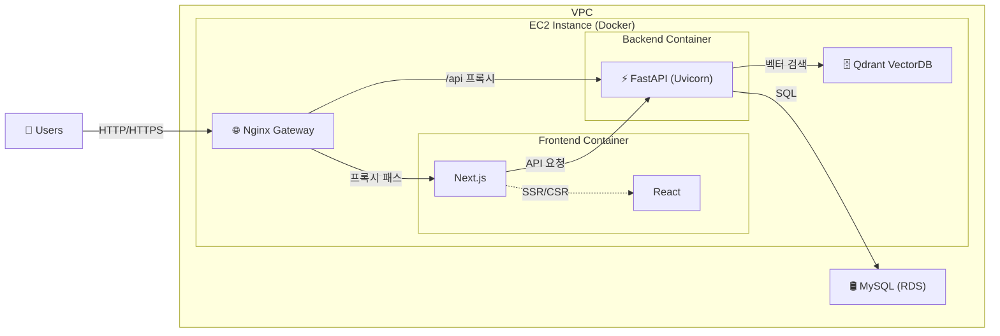
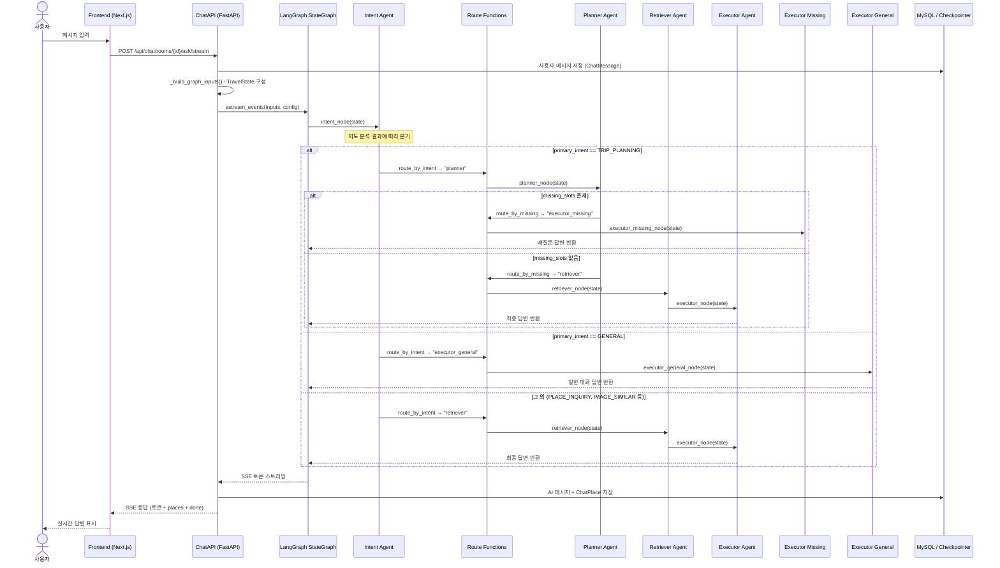
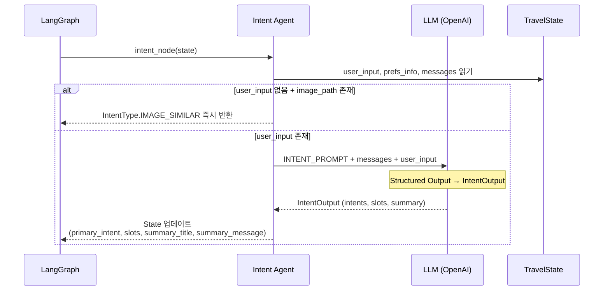
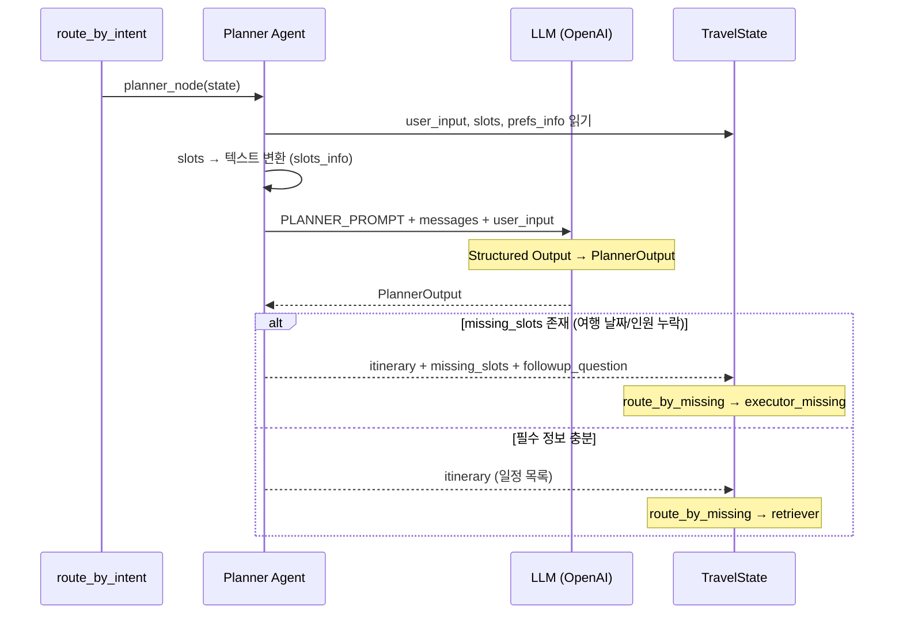
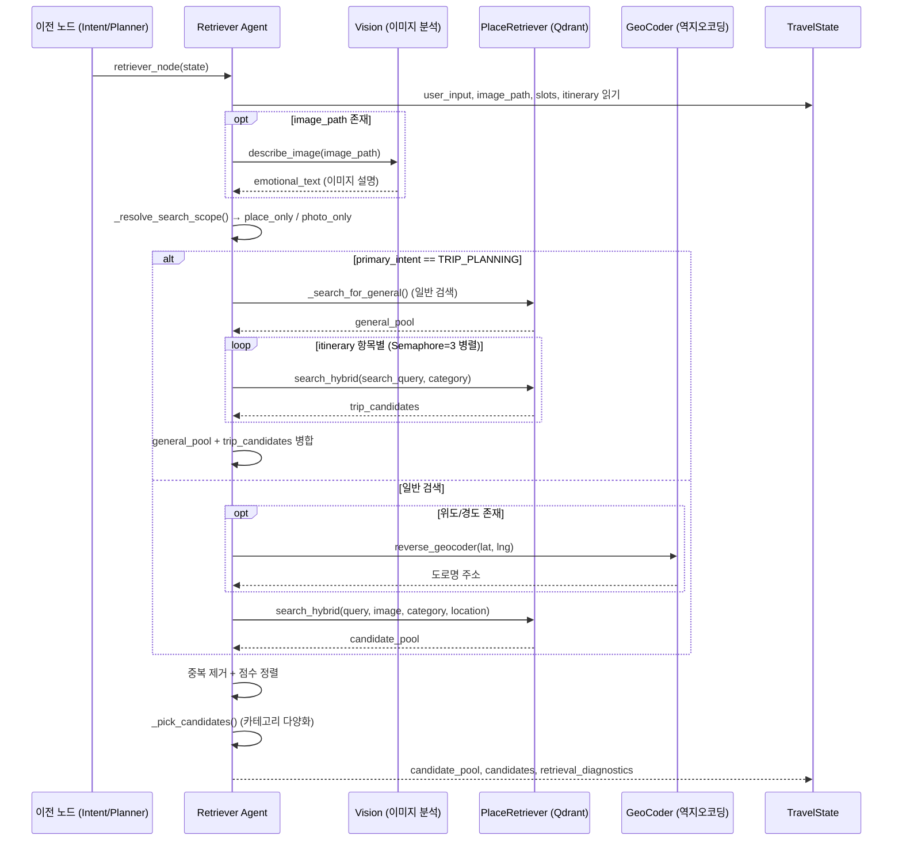
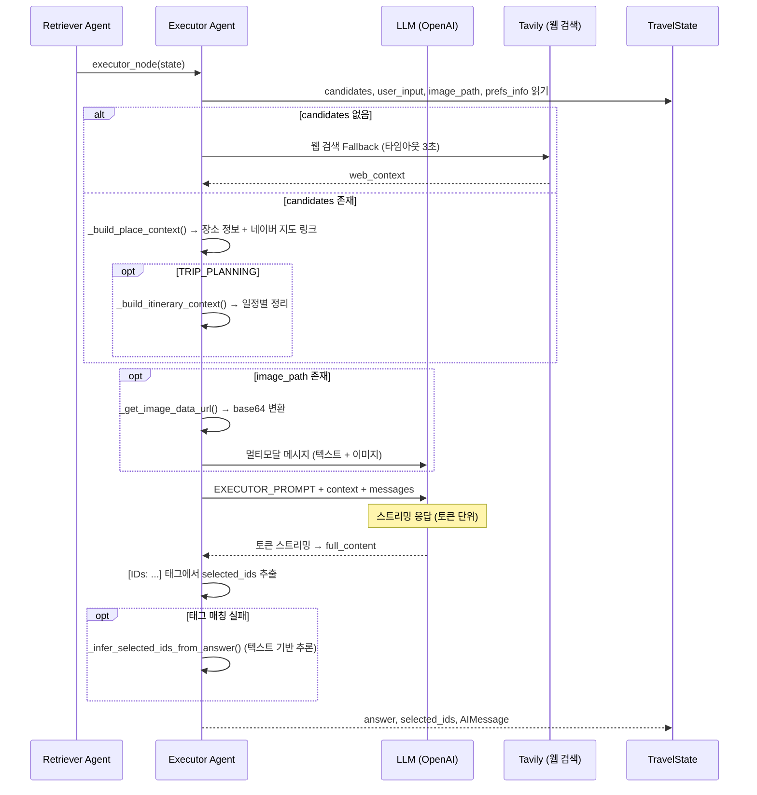
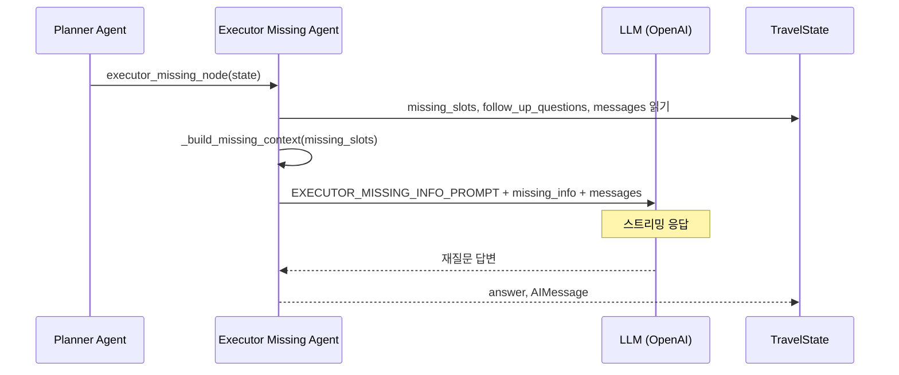
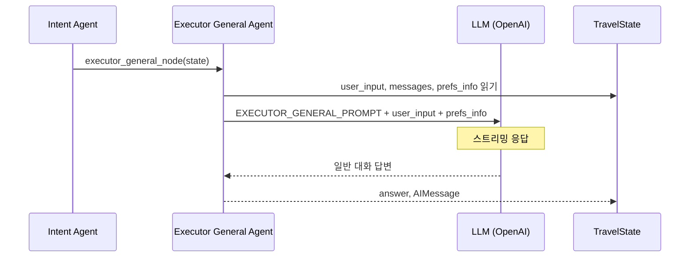
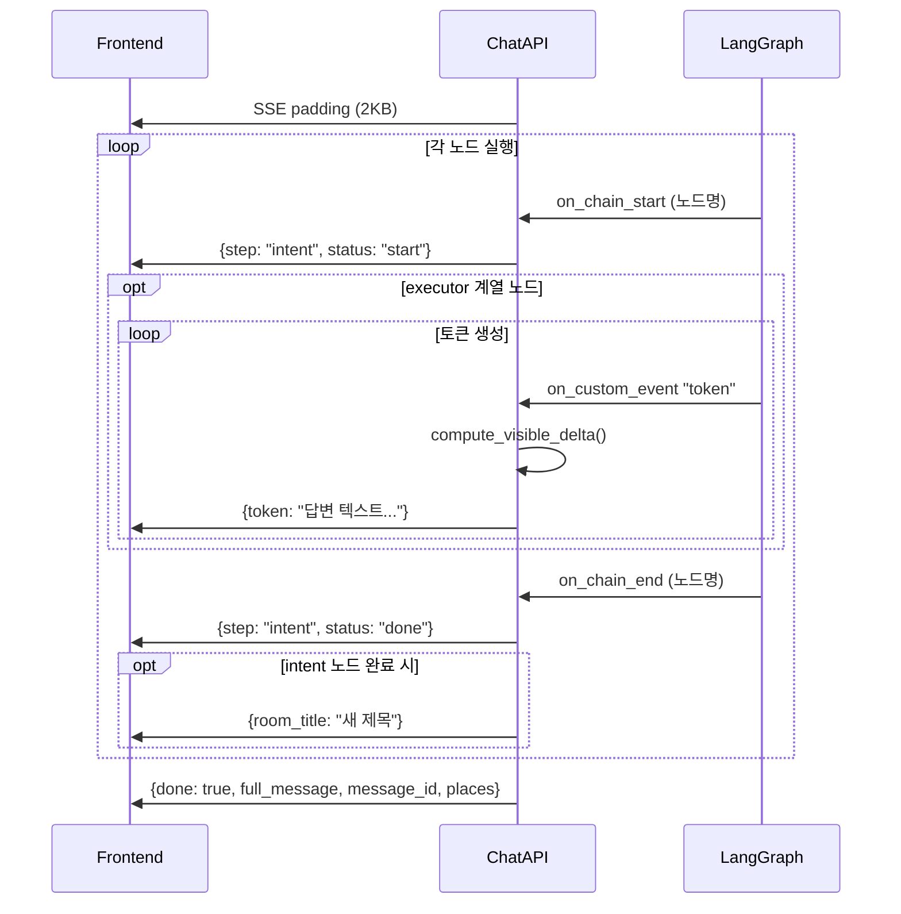

# 여행 챗봇 에이전트 시퀀스 다이어그램

> LangGraph 기반 멀티 에이전트 파이프라인의 동작 흐름을 시퀀스 다이어그램으로 정리한 문서입니다.

---

## 목차

0. [시스템 인프라 컴포넌트 다이어그램](#0-시스템-인프라-컴포넌트-다이어그램)
1. [아키텍처 개요](#1-아키텍처-개요)
2. [전체 흐름 (Graph Workflow)](#2-전체-흐름-graph-workflow)
3. [Intent Agent](#3-intent-agent)
4. [Planner Agent](#4-planner-agent)
5. [Retriever Agent](#5-retriever-agent)
6. [Executor Agent](#6-executor-agent)
7. [Executor Missing Agent](#7-executor-missing-agent)
8. [Executor General Agent](#8-executor-general-agent)
9. [구성요소 설명](#9-구성요소-설명)
10. [액티비티 다이어그램](#10-액티비티-다이어그램)

---

## 0. 시스템 인프라 컴포넌트 다이어그램

전체 시스템의 배포 아키텍처와 각 컴포넌트 간 통신 흐름입니다.

### 컴포넌트 설명

| 컴포넌트 | 기술 스택 | 역할 | 비고 |
|----------|----------|------|------|
| **Users** | 웹 브라우저 | 서비스 사용자 | 채팅, 장소 검색, 여행 계획 |
| **Nginx Gateway** | Nginx (Docker) | 리버스 프록시 / 정적 파일 서빙 | `/api/*` → FastAPI, 나머지 → Next.js |
| **Next.js + React** | Next.js 14, React 18 (Docker) | 프론트엔드 SPA | SSR/CSR 하이브리드, SSE 스트리밍 수신 |
| **FastAPI** | Python, FastAPI, Uvicorn (Docker) | 백엔드 API 서버 | LangGraph 에이전트 실행, REST API, SSE 스트리밍 |
| **Qdrant VectorDB** | Qdrant (Docker) | 벡터 데이터베이스 | 장소/사진 임베딩 저장, 하이브리드 검색 (Dense + BM25 + Rerank) |
| **MySQL (RDS)** | AWS RDS MySQL | 관계형 데이터베이스 | 사용자, 채팅방, 메시지, 장소 북마크, 체크포인터 데이터 |

### 네트워크 흐름

| 경로 | 프로토콜 | 설명 |
|------|---------|------|
| Users → Nginx | HTTP/HTTPS | 외부 트래픽 진입점 |
| Nginx → Next.js | HTTP (내부) | 프론트엔드 페이지 렌더링 |
| Nginx → FastAPI | HTTP (내부) | `/api/*` 경로 프록시 (Uvicorn) |
| Next.js → FastAPI | HTTP (내부) | 클라이언트 사이드 API 호출 |
| FastAPI → RDS | TCP (3306) | SQL 쿼리 (SQLAlchemy) |
| FastAPI → Qdrant | HTTP (6333) | 벡터 검색 API |

---

## 1. 아키텍처 개요

이 프로젝트는 **LangGraph StateGraph**를 사용하여 여행 추천 챗봇의 에이전트 파이프라인을 구성합니다.  
사용자 메시지가 들어오면 의도 분석 → 조건부 라우팅 → 검색/계획 → 최종 답변 생성 순서로 처리됩니다.

### 핵심 노드 구성

| 노드 | 파일 | 역할 |
|------|------|------|
| `intent` | `agents/intent.py` | 사용자 의도 분석 (GENERAL / PLACE_INQUIRY / TRIP_PLANNING 등) |
| `planner` | `agents/planner.py` | 여행 일정 초안 생성 및 필수 정보 누락 감지 |
| `retriever` | `agents/retriever.py` | Qdrant 벡터DB 하이브리드 검색 + 리랭킹 |
| `executor` | `agents/executor.py` | 검색 결과 기반 최종 답변 생성 (스트리밍) |
| `executor_missing` | `agents/executor.py` | 누락 정보 재질문 답변 생성 |
| `executor_general` | `agents/executor.py` | 일상 대화 답변 생성 |

### 라우팅 함수

| 함수 | 파일 | 역할 |
|------|------|------|
| `route_by_intent` | `agents/grapy_route.py` | Intent 결과에 따라 다음 노드 결정 |
| `route_by_missing` | `agents/grapy_route.py` | Planner 결과에서 누락 슬롯 여부로 분기 |

---

## 2. 전체 흐름 (Graph Workflow)

사용자 메시지 입력부터 최종 응답까지의 전체 에이전트 파이프라인 흐름입니다.

---

## 3. Intent Agent

사용자 입력의 의도를 분석하고 슬롯(장소, 카테고리, 날짜 등)을 추출합니다.

**IntentOutput 구조:**
- `intents`: 감지된 의도 목록 (List[IntentType])
- `primary_intent`: 주 의도 (GENERAL / PLACE_INQUIRY / TRIP_PLANNING / IMAGE_SIMILAR 등)
- `slots`: 추출된 정보 (location, category, dates, duration, party_size, budget_level 등)
- `summary_title`: 채팅방 제목용 요약 (10자 이내)
- `summary_message`: 대화 요약

---

## 4. Planner Agent

여행 계획형 요청에 대해 일정 초안을 생성하고 필수 정보 누락 여부를 판단합니다.

**PlannerOutput 구조:**
- `itinerary`: 일차/시간대별 여행 일정 항목 리스트
  - `day`, `time_slot` (morning/afternoon/evening), `activity`, `search_query`, `category`
- `missing_slots`: 누락된 필수 정보 (여행 날짜, 여행 인원)
- `followup_question`: 후속 질문 문장

---

## 5. Retriever Agent

Qdrant 벡터DB에서 하이브리드 검색(텍스트 + 이미지 + BM25 + Rerank)을 수행합니다.

**검색 파라미터:**
- `candidate_k`: 초기 후보 풀 크기
- `final_k`: 최종 노출 후보 수
- `rerank_max_k`: 리랭킹 대상 최대 수
- `selection_mode`: `deterministic` (점수 우선) / `explore` (랜덤 다양화)

---

## 6. Executor Agent

검색된 장소 후보를 기반으로 최종 추천 답변을 스트리밍 생성합니다.

**주요 기능:**
- **Tavily Fallback**: 검색 결과가 없을 때 웹 검색으로 보완 (3초 타임아웃)
- **멀티모달**: 이미지가 있으면 base64 인코딩하여 LLM에 전달
- **ID 추출**: 답변에서 `[IDs: id1, id2]` 태그 → 없으면 텍스트 매칭으로 장소 ID 추론

---

## 7. Executor Missing Agent

Planner에서 필수 정보(여행 날짜, 인원)가 누락되었을 때 자연스러운 재질문을 생성합니다.

---

## 8. Executor General Agent

여행과 무관한 일반 대화(인사, 잡담 등)에 대한 응답을 생성합니다.

---

## 9. 구성요소 설명

### TravelState (상태 관리)

LangGraph의 `TypedDict` 기반 상태 객체로, 모든 에이전트 노드 간 데이터를 공유합니다.

| 분류 | 필드 | 설명 |
|------|------|------|
| **입력** | `user_input` | 사용자 메시지 텍스트 |
| | `user_id`, `room_id` | 사용자/채팅방 식별자 |
| | `latitude`, `longitude` | 사용자 현재 위치 |
| | `image_path` | 업로드 이미지 경로 |
| **대화** | `messages` | 대화 히스토리 (add_messages 리듀서) |
| | `prefs_info` | 사용자 여행 선호도 문자열 |
| **Intent** | `primary_intent` | 주 의도 (IntentType enum) |
| | `slots` | 추출된 슬롯 정보 (IntentSlots) |
| | `summary_title/message` | 대화 요약 |
| **Planner** | `itinerary` | 일정 계획 리스트 |
| | `missing_slots` | 누락 필수 정보 |
| **Retriever** | `candidate_pool` | 전체 검색 후보 풀 |
| | `candidates` | 최종 노출 후보 |
| **출력** | `answer` | 최종 답변 텍스트 |
| | `selected_ids` | 선택된 장소 ID 목록 |

### IntentType (의도 분류)

| 값 | 설명 | 라우팅 |
|----|------|--------|
| `GENERAL` | 일상 대화, 인사 | → `executor_general` |
| `PLACE_INQUIRY` | 장소 검색/추천 | → `retriever` → `executor` |
| `TRIP_PLANNING` | 여행 계획 수립 | → `planner` → (분기) |
| `IMAGE_SIMILAR` | 이미지 유사 장소 검색 | → `retriever` → `executor` |
| `BOOKING` | 예약 관련 | → `retriever` → `executor` |
| `REVIEWS` | 리뷰 관련 | → `retriever` → `executor` |
| `BUDGET` | 예산 관련 | → `retriever` → `executor` |
| `INFO_QA` | 정보 검색 | → `retriever` → `executor` |

### SSE 스트리밍 이벤트 흐름

### 주요 외부 의존성

| 컴포넌트 | 역할 |
|----------|------|
| **Qdrant** | 벡터 데이터베이스 (장소/사진 임베딩 저장 및 검색) |
| **OpenAI** | LLM (의도 분석, 계획 생성, 답변 생성) |
| **Tavily** | 웹 검색 API (검색 결과 없을 때 Fallback) |
| **MySQL** | 사용자/채팅방/메시지/장소 데이터 저장 |
| **Naver Map** | 지도 링크 생성 |
| **LangGraph Checkpointer** | 대화 상태 체크포인팅 (AsyncMySaver) |

---

## 10. 액티비티 다이어그램

사용자 메시지 입력부터 최종 응답까지의 전체 처리 흐름을 액티비티 다이어그램으로 표현합니다.

```mermaid
flowchart LR
    %% ── 1. 입력 ──
    subgraph INPUT["📥 입력 처리"]
        direction TB
        Start(["🟢 메시지 입력"]) --> SaveMsg["DB 저장"]
        SaveMsg --> BuildState["TravelState 구성"]
    end

    %% ── 2. 의도 분석 ──
    subgraph INTENT["🧠 의도 분석"]
        direction TB
        IntentAgent["Intent Agent"]
        IntentAgent --> CheckInput{"입력 타입"}
        CheckInput -->|"이미지만"| ImgIntent["IMAGE_SIMILAR"]
        CheckInput -->|"텍스트"| LLMIntent["LLM 분석"]
        LLMIntent --> IntentOut["IntentOutput"]
        ImgIntent --> Route{"의도 분기"}
        IntentOut --> Route
    end

    %% ── 3. 계획 / 검색 ──
    subgraph PROCESS["📋 계획 & 검색"]
        direction TB
        Planner["Planner Agent"] --> CheckMiss{"정보 누락?"}
        CheckMiss -->|"누락"| ExecMissing["❓ 재질문 생성"]
        CheckMiss -->|"충분"| Retriever

        Retriever["🔍 Retriever Agent"]
        Retriever --> CheckImg{"이미지?"}
        CheckImg -->|"있음"| Vision["Vision 분석"]
        Vision --> Search["Qdrant 검색"]
        CheckImg -->|"없음"| Search
        Search --> Dedup["중복제거 + 다양화"]
    end

    %% ── 4. 실행 ──
    subgraph EXEC["⚡ 답변 생성"]
        direction TB
        Executor["Executor Agent"]
        Executor --> CheckCand{"후보 유무"}
        CheckCand -->|"없음"| Tavily["Tavily Fallback"]
        CheckCand -->|"있음"| Context["컨텍스트 구성"]
        Tavily --> Context
        Context --> LLMExec["LLM 스트리밍"]
        LLMExec --> ExtractID["장소 ID 추출"]

        ExecGeneral["💬 일반 대화"]
    end

    %% ── 5. 출력 ──
    subgraph OUTPUT["📤 출력 처리"]
        direction TB
        SaveAI["AI 메시지 저장"] --> SavePlace["ChatPlace 저장"]
        SavePlace --> Done(["🔴 응답 완료"])
    end

    %% ── 연결 ──
    INPUT --> INTENT
    Route -->|"GENERAL"| ExecGeneral
    Route -->|"TRIP_PLANNING"| Planner
    Route -->|"PLACE_INQUIRY 등"| Retriever
    ExecMissing --> SaveAI
    Dedup --> Executor
    ExtractID --> SaveAI
    ExecGeneral --> SaveAI

    %% 스타일
    style Start fill:#4CAF50,color:#fff
    style Done fill:#f44336,color:#fff
    style IntentAgent fill:#2196F3,color:#fff
    style Planner fill:#FF9800,color:#fff
    style Retriever fill:#9C27B0,color:#fff
    style Executor fill:#00BCD4,color:#fff
    style ExecMissing fill:#FFC107,color:#333
    style ExecGeneral fill:#8BC34A,color:#fff
```

### 액티비티 구성요소 설명

#### 주요 액티비티 (노드)

| 액티비티 | 색상 | 설명 |
|----------|------|------|
| **사용자 메시지 입력** | 🟢 초록 | 시작점. 사용자가 텍스트/이미지를 전송 |
| **Intent Agent** | 🔵 파랑 | LLM으로 사용자 의도 분류 및 슬롯(장소, 날짜 등) 추출 |
| **Planner Agent** | 🟠 주황 | 여행 일정 초안 생성, 필수 정보 누락 감지 |
| **Retriever Agent** | 🟣 보라 | Qdrant 벡터DB 하이브리드 검색 + 카테고리 다양화 |
| **Executor Agent** | 🔷 청록 | 검색 결과 기반 최종 추천 답변 스트리밍 생성 |
| **Executor Missing** | 🟡 노랑 | 필수 정보 누락 시 자연스러운 재질문 생성 |
| **Executor General** | 🟢 연두 | 일상 대화(인사, 잡담) 응답 생성 |
| **응답 완료** | 🔴 빨강 | 종료점. SSE done 이벤트 전송 완료 |

#### 분기 조건 (Decision)

| 분기 | 조건 | 분기 결과 |
|------|------|-----------|
| **user_input 존재 여부** | 텍스트 입력 유무 | 텍스트 있음 → LLM 의도 분석 / 텍스트 없음+이미지 → IMAGE_SIMILAR |
| **primary_intent 분기** | Intent Agent 결과 | GENERAL → 일반 대화 / TRIP_PLANNING → Planner / 그 외 → Retriever |
| **필수 정보 누락 여부** | Planner 분석 결과 | 누락 있음 → 재질문 / 정보 충분 → Retriever 검색 진행 |
| **이미지 존재 여부** | image_path 유무 | 있음 → Vision API 분석 후 검색 / 없음 → 텍스트만 검색 |
| **TRIP_PLANNING 여부** | intent 타입 확인 | Yes → itinerary별 병렬 검색 추가 / No → 일반 검색만 |
| **candidates 존재 여부** | Retriever 검색 결과 | 있음 → 장소 컨텍스트 구성 / 없음 → Tavily 웹 검색 Fallback |

#### 데이터 처리 단계

| 단계 | 설명 |
|------|------|
| **TravelState 구성** | 사용자 선호도, 위치, 이미지 등을 state에 주입 |
| **Qdrant 하이브리드 검색** | Dense 벡터 + BM25 + Cross-encoder Rerank |
| **카테고리 다양화 선택** | 상위 후보에서 카테고리 중복 최소화하여 최종 노출 후보 선택 |
| **선택 장소 ID 추출** | LLM 답변에서 `[IDs: ...]` 태그 파싱 또는 텍스트 매칭으로 추론 |
| **ChatPlace 저장** | 추천 장소 최대 3개를 DB에 저장 (이름, 주소, 좌표, 이미지) |
| **SSE done 이벤트** | 전체 답변 + 메시지 ID + 장소 정보를 프론트엔드에 최종 전송 |
