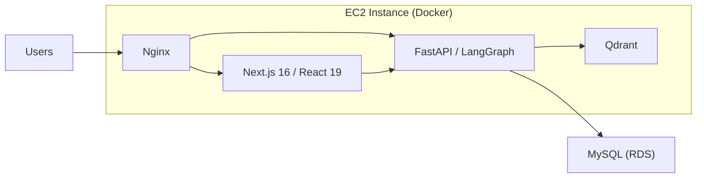
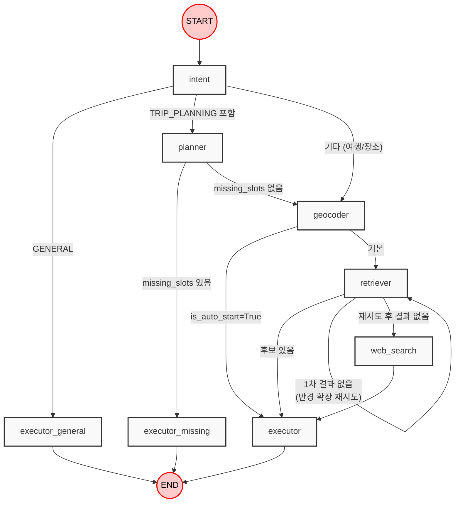
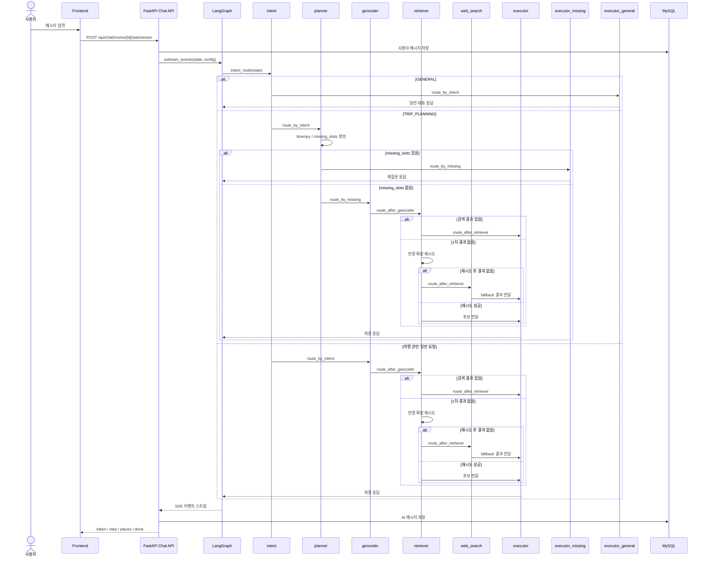
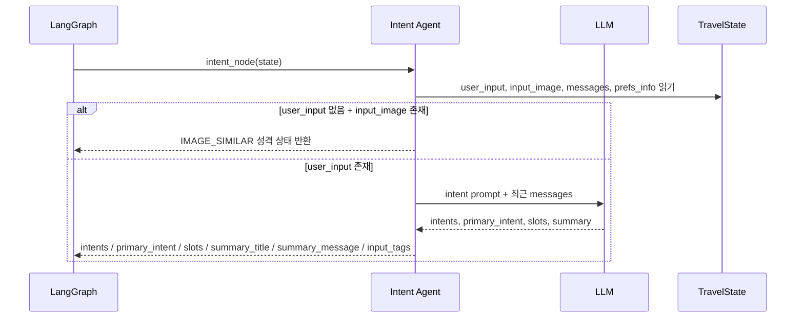
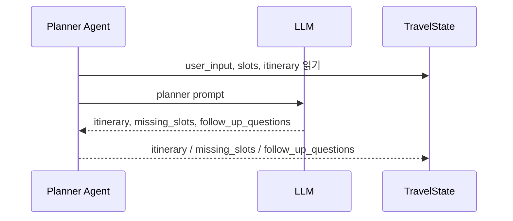
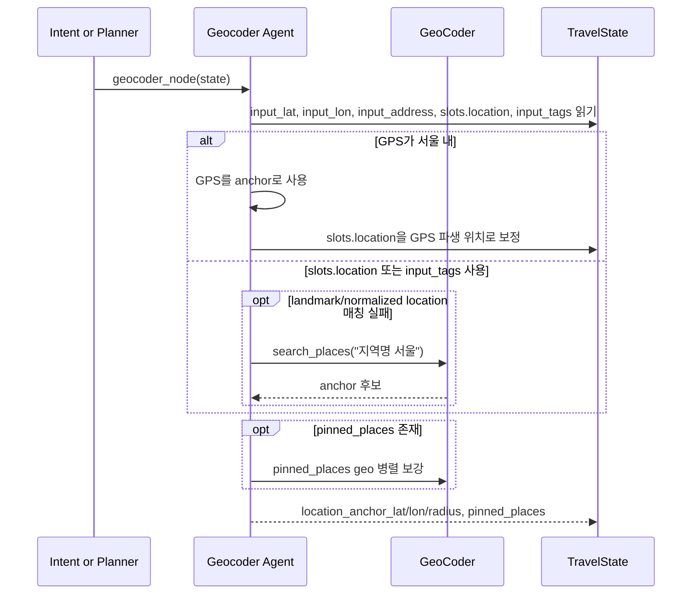
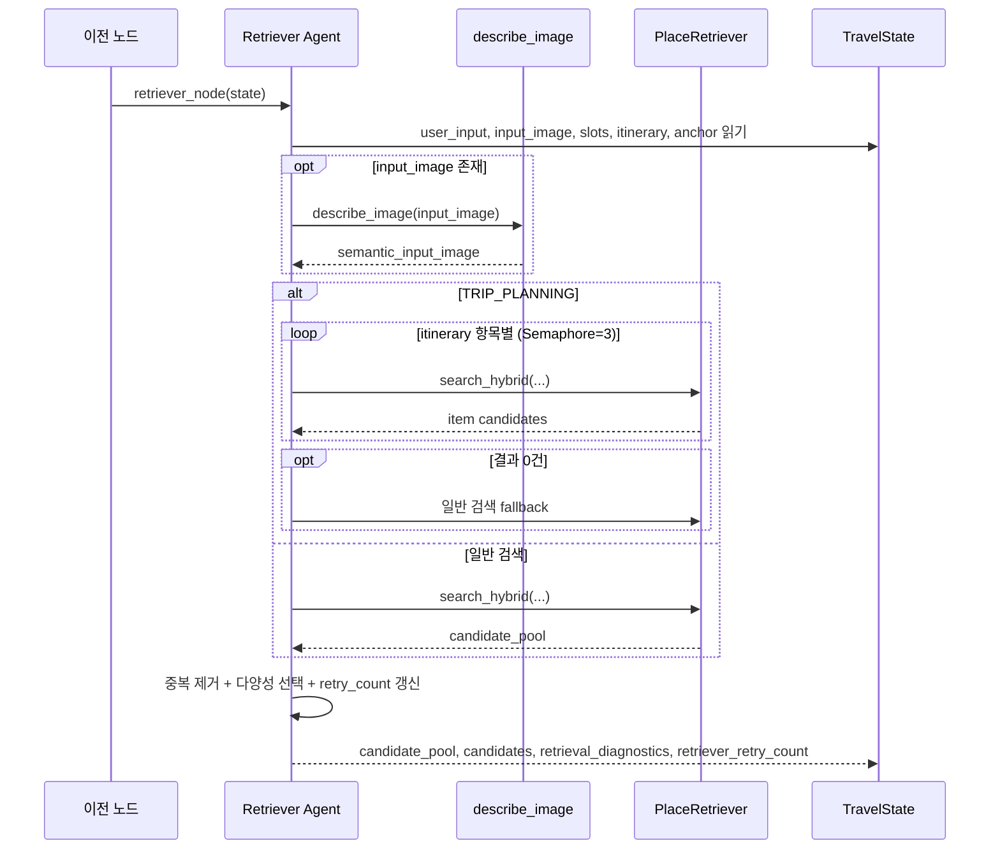
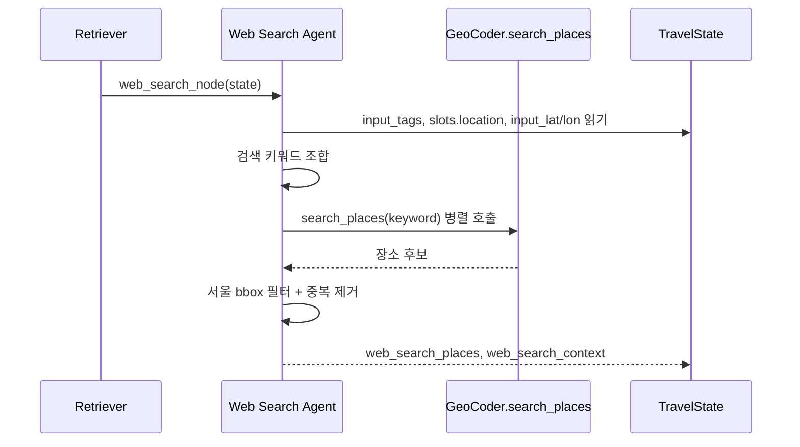
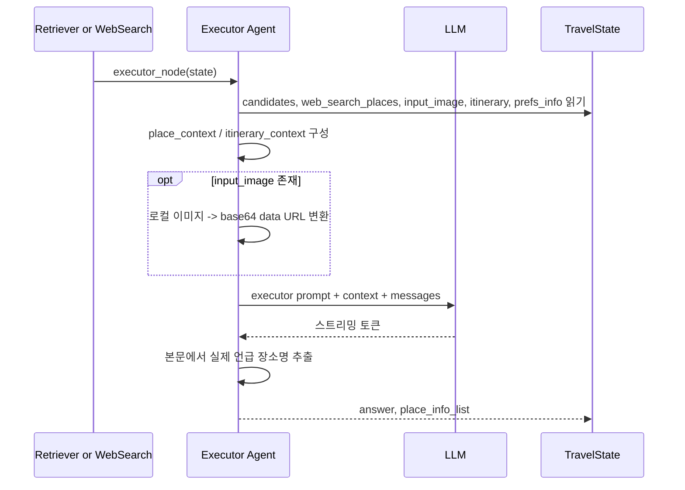
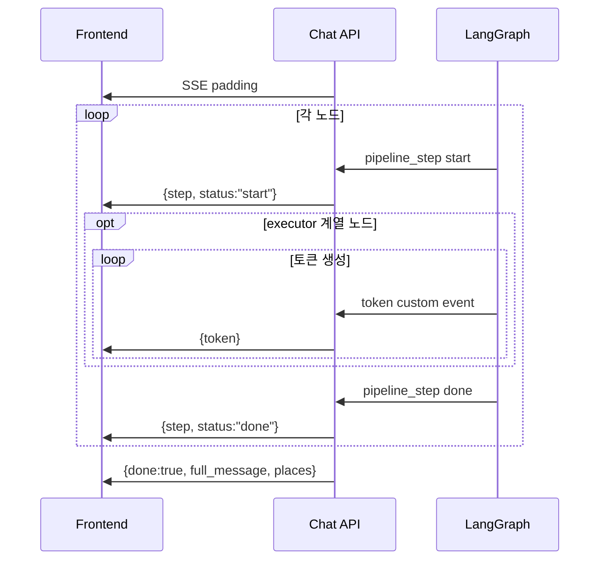

# 여행 챗봇 에이전트 시퀀스 다이어그램

> LangGraph 기반 멀티 에이전트 파이프라인의 현재 동작 흐름을 정리한 문서

---

## 1. 시스템 인프라

```mermaid
graph LR
    Users["Users"]

    subgraph EC2["EC2 Instance (Docker)"]
        Nginx["Nginx"]
        Frontend["Next.js 16 / React 19"]
        Backend["FastAPI / LangGraph"]
        Qdrant["Qdrant"]
    end

    RDS["MySQL (RDS)"]

    Users --> Nginx
    Nginx --> Frontend
    Nginx --> Backend
    Frontend --> Backend
    Backend --> Qdrant
    Backend --> RDS
```

---

## 2. 그래프 개요

현재 그래프 노드는 아래와 같다.

| 노드 | 파일 | 역할 |
| --- | --- | --- |
| `intent` | `backend/app/agents/intent.py` | 의도 분석, 슬롯 추출, 입력 태그/요약 생성 |
| `planner` | `backend/app/agents/planner.py` | 여행 일정 초안 생성, 누락 정보 판정 |
| `geocoder` | `backend/app/agents/geocoder_node.py` | GPS/랜드마크 기반 위치 anchor 확정 |
| `retriever` | `backend/app/agents/retriever.py` | Qdrant hybrid retrieval, 후보 선별 |
| `web_search` | `backend/app/agents/web_search_node.py` | 결과 0건 시 Naver Local Search fallback |
| `executor` | `backend/app/agents/executor.py` | 검색 결과 기반 최종 답변 생성 |
| `executor_missing` | `backend/app/agents/executor.py` | 누락 정보 재질문 |
| `executor_general` | `backend/app/agents/executor.py` | 일반 대화 응답 |

라우팅 함수:

- `route_by_intent`
- `route_by_missing`
- `route_after_geocoder`
- `route_after_retriever`

### LangGraph State Diagram

```mermaid
graph TD
    __start__((START)) --> intent

    intent -- "GENERAL" --> executor_general
    intent -- "TRIP_PLANNING 포함" --> planner
    intent -- "기타 (여행/장소)" --> geocoder

    planner -- "missing_slots 있음" --> executor_missing
    planner -- "missing_slots 없음" --> geocoder

    geocoder -- "is_auto_start=True" --> executor
    geocoder -- "기본" --> retriever

    retriever -- "후보 있음" --> executor
    retriever -- "1차 결과 없음\n(반경 확장 재시도)" --> retriever
    retriever -- "재시도 후 결과 없음" --> web_search

    web_search --> executor

    executor --> __end__((END))
    executor_missing --> __end__((END))
    executor_general --> __end__((END))

    classDef default fill:#f9f9f9,stroke:#333,stroke-width:2px;
    classDef startend fill:#ffcccb,stroke:#ff0000,stroke-width:2px,color:#000;
    class __start__,__end__ startend;
```

---

## 3. 전체 흐름

```mermaid
sequenceDiagram
    actor User as 사용자
    participant FE as Frontend
    participant API as FastAPI Chat API
    participant Graph as LangGraph
    participant Intent as intent
    participant Planner as planner
    participant Geocoder as geocoder
    participant Retriever as retriever
    participant WebSearch as web_search
    participant Executor as executor
    participant ExecMissing as executor_missing
    participant ExecGeneral as executor_general
    participant DB as MySQL

    User->>FE: 메시지 입력
    FE->>API: POST /api/chat/rooms/{id}/ask/stream
    API->>DB: 사용자 메시지 저장
    API->>Graph: astream_events(state, config)

    Graph->>Intent: intent_node(state)

    alt GENERAL
        Intent->>ExecGeneral: route_by_intent
        ExecGeneral-->>Graph: 일반 대화 응답
    else TRIP_PLANNING
        Intent->>Planner: route_by_intent
        Planner->>Planner: itinerary / missing_slots 생성
        alt missing_slots 있음
            Planner->>ExecMissing: route_by_missing
            ExecMissing-->>Graph: 재질문 응답
        else missing_slots 없음
            Planner->>Geocoder: route_by_missing
            Geocoder->>Retriever: route_after_geocoder
            alt 검색 결과 있음
                Retriever->>Executor: route_after_retriever
            else 1차 결과 없음
                Retriever->>Retriever: 반경 확장 재시도
                alt 재시도 후 결과 없음
                    Retriever->>WebSearch: route_after_retriever
                    WebSearch->>Executor: fallback 결과 전달
                else 재시도 성공
                    Retriever->>Executor: 후보 전달
                end
            end
            Executor-->>Graph: 최종 응답
        end
    else 여행 관련 일반 요청
        Intent->>Geocoder: route_by_intent
        Geocoder->>Retriever: route_after_geocoder
        alt 검색 결과 있음
            Retriever->>Executor: route_after_retriever
        else 1차 결과 없음
            Retriever->>Retriever: 반경 확장 재시도
            alt 재시도 후 결과 없음
                Retriever->>WebSearch: route_after_retriever
                WebSearch->>Executor: fallback 결과 전달
            else 재시도 성공
                Retriever->>Executor: 후보 전달
            end
        end
        Executor-->>Graph: 최종 응답
    end

    Graph-->>API: SSE 이벤트 스트림
    API->>DB: AI 메시지 저장
    API-->>FE: token / step / places / done
```

---

## 4. Intent Agent

```mermaid
sequenceDiagram
    participant Graph as LangGraph
    participant Intent as Intent Agent
    participant LLM as LLM
    participant State as TravelState

    Graph->>Intent: intent_node(state)
    Intent->>State: user_input, input_image, messages, prefs_info 읽기

    alt user_input 없음 + input_image 존재
        Intent-->>Graph: IMAGE_SIMILAR 성격 상태 반환
    else user_input 존재
        Intent->>LLM: intent prompt + 최근 messages
        LLM-->>Intent: intents, primary_intent, slots, summary
        Intent-->>Graph: intents / primary_intent / slots / summary_title / summary_message / input_tags
    end
```

주요 상태 갱신:

- `intents`
- `primary_intent`
- `slots`
- `summary_title`
- `summary_message`
- `input_tags`
- `input_address`
- `gps_outside_seoul`
- `weather_info`

---

## 5. Planner Agent

```mermaid
sequenceDiagram
    participant Planner as Planner Agent
    participant LLM as LLM
    participant State as TravelState

    Planner->>State: user_input, slots, itinerary 읽기
    Planner->>LLM: planner prompt
    LLM-->>Planner: itinerary, missing_slots, follow_up_questions
    Planner-->>State: itinerary / missing_slots / follow_up_questions
```

분기:

- `missing_slots`가 있으면 `executor_missing`
- 없으면 `geocoder`

---

## 6. Geocoder Agent

```mermaid
sequenceDiagram
    participant Prev as Intent or Planner
    participant Geocoder as Geocoder Agent
    participant Naver as GeoCoder
    participant State as TravelState

    Prev->>Geocoder: geocoder_node(state)
    Geocoder->>State: input_lat, input_lon, input_address, slots.location, input_tags 읽기

    alt GPS가 서울 내
        Geocoder->>Geocoder: GPS를 anchor로 사용
        Geocoder->>State: slots.location을 GPS 파생 위치로 보정
    else slots.location 또는 input_tags 사용
        opt landmark/normalized location 매칭 실패
            Geocoder->>Naver: search_places("지역명 서울")
            Naver-->>Geocoder: anchor 후보
        end
    end

    opt pinned_places 존재
        Geocoder->>Naver: pinned_places geo 병렬 보강
    end

    Geocoder-->>State: location_anchor_lat/lon/radius, pinned_places
```

---

## 7. Retriever Agent

```mermaid
sequenceDiagram
    participant Prev as 이전 노드
    participant Retriever as Retriever Agent
    participant Vision as describe_image
    participant PlaceDB as PlaceRetriever
    participant State as TravelState

    Prev->>Retriever: retriever_node(state)
    Retriever->>State: user_input, input_image, slots, itinerary, anchor 읽기

    opt input_image 존재
        Retriever->>Vision: describe_image(input_image)
        Vision-->>Retriever: semantic_input_image
    end

    alt TRIP_PLANNING
        loop itinerary 항목별 (Semaphore=3)
            Retriever->>PlaceDB: search_hybrid(...)
            PlaceDB-->>Retriever: item candidates
        end
        opt 결과 0건
            Retriever->>PlaceDB: 일반 검색 fallback
        end
    else 일반 검색
        Retriever->>PlaceDB: search_hybrid(...)
        PlaceDB-->>Retriever: candidate_pool
    end

    Retriever->>Retriever: 중복 제거 + 다양성 선택 + retry_count 갱신
    Retriever-->>State: candidate_pool, candidates, retrieval_diagnostics, retriever_retry_count
```

검색 후 라우팅:

- `candidates` 있음 → `executor`
- 1차 0건 → `retriever` 재진입
- 재시도 후에도 0건 → `web_search`

---

## 8. Web Search Agent

```mermaid
sequenceDiagram
    participant Retriever as Retriever
    participant WebSearch as Web Search Agent
    participant Naver as GeoCoder.search_places
    participant State as TravelState

    Retriever->>WebSearch: web_search_node(state)
    WebSearch->>State: input_tags, slots.location, input_lat/lon 읽기
    WebSearch->>WebSearch: 검색 키워드 조합
    WebSearch->>Naver: search_places(keyword) 병렬 호출
    Naver-->>WebSearch: 장소 후보
    WebSearch->>WebSearch: 서울 bbox 필터 + 중복 제거
    WebSearch-->>State: web_search_places, web_search_context
```

주의:

- 현재 기본 fallback은 Tavily가 아니라 Naver Local Search다.

---

## 9. Executor Agent

```mermaid
sequenceDiagram
    participant Prev as Retriever or WebSearch
    participant Executor as Executor Agent
    participant LLM as LLM
    participant State as TravelState

    Prev->>Executor: executor_node(state)
    Executor->>State: candidates, web_search_places, input_image, itinerary, prefs_info 읽기
    Executor->>Executor: place_context / itinerary_context 구성

    opt input_image 존재
        Executor->>Executor: 로컬 이미지 -> base64 data URL 변환
    end

    Executor->>LLM: executor prompt + context + messages
    LLM-->>Executor: 스트리밍 토큰
    Executor->>Executor: 본문에서 실제 언급 장소명 추출
    Executor-->>State: answer, place_info_list
```

특징:

- 후보와 `PlaceInfo`를 짝으로 유지해 잘못된 장소 매핑을 막는다
- 답변 본문에 실제로 등장한 장소만 `place_info_list`에 남긴다
- `is_auto_start=True`인 경우 geocoder 뒤에 retriever를 건너뛰고 executor로 갈 수 있다

---

## 10. Executor Missing / General

### Missing

- 입력: `missing_slots`, `follow_up_questions`, `messages`
- 역할: 누락 정보에 대한 자연스러운 재질문 생성

### General

- 입력: `user_input`, `messages`, `prefs_info`
- 역할: 여행 계획/검색이 아닌 일반 대화 응답 생성

---

## 11. TravelState 핵심 필드

| 분류 | 필드 | 설명 |
| --- | --- | --- |
| 입력 | `user_input` | 사용자 텍스트 입력 |
| 입력 | `input_image` | 사용자 입력 이미지 경로/URL |
| 입력 | `input_lat`, `input_lon`, `input_address` | 사용자 현재 위치 |
| 대화 | `messages` | 대화 히스토리 |
| intent | `intents`, `primary_intent`, `slots`, `input_tags` | 의도 분석 결과 |
| planner | `itinerary`, `missing_slots`, `follow_up_questions`, `pinned_places` | 일정 계획 상태 |
| geocoder | `location_anchor_lat/lon/radius_m` | 검색 anchor |
| retriever | `candidate_pool`, `candidates`, `retrieval_diagnostics`, `retriever_retry_count` | 검색 결과 |
| fallback | `web_search_places`, `web_search_context` | 웹 검색 fallback 결과 |
| final | `answer`, `place_info_list` | 최종 응답 |

---

## 12. SSE 이벤트 흐름

```mermaid
sequenceDiagram
    participant FE as Frontend
    participant API as Chat API
    participant Graph as LangGraph

    API->>FE: SSE padding

    loop 각 노드
        Graph->>API: pipeline_step start
        API->>FE: {step, status:"start"}

        opt executor 계열 노드
            loop 토큰 생성
                Graph->>API: token custom event
                API->>FE: {token}
            end
        end

        Graph->>API: pipeline_step done
        API->>FE: {step, status:"done"}
    end

    API->>FE: {done:true, full_message, places}
```

---

## 13. 문서 관리 메모

- 노드 추가/삭제 시 이 문서와 [BACKEND_STRUCTURE.md](/Users/kim/SKN21-FINAL-2Team/docs/BACKEND_STRUCTURE.md)를 함께 수정
- fallback 검색 경로가 바뀌면 [RETRIEVAL_PLACE.md](/Users/kim/SKN21-FINAL-2Team/docs/RETRIEVAL_PLACE.md), [llm_model_software.md](/Users/kim/SKN21-FINAL-2Team/docs/llm_model_software.md)도 동시 갱신
